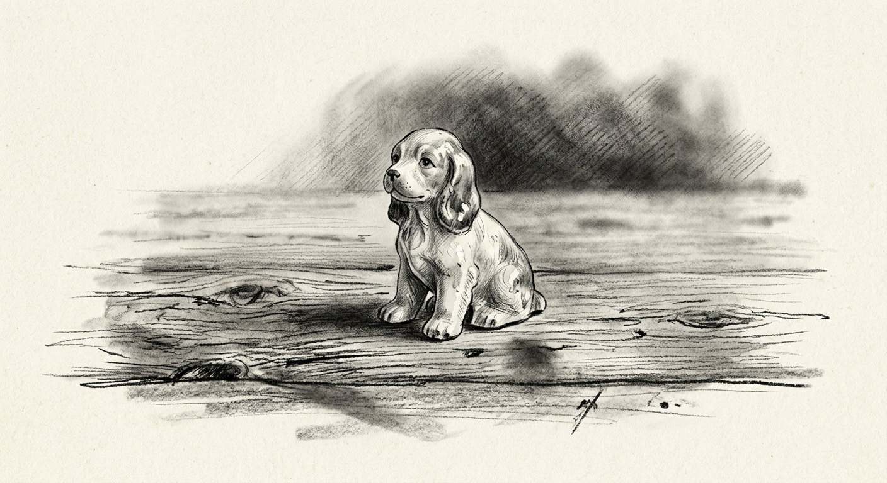
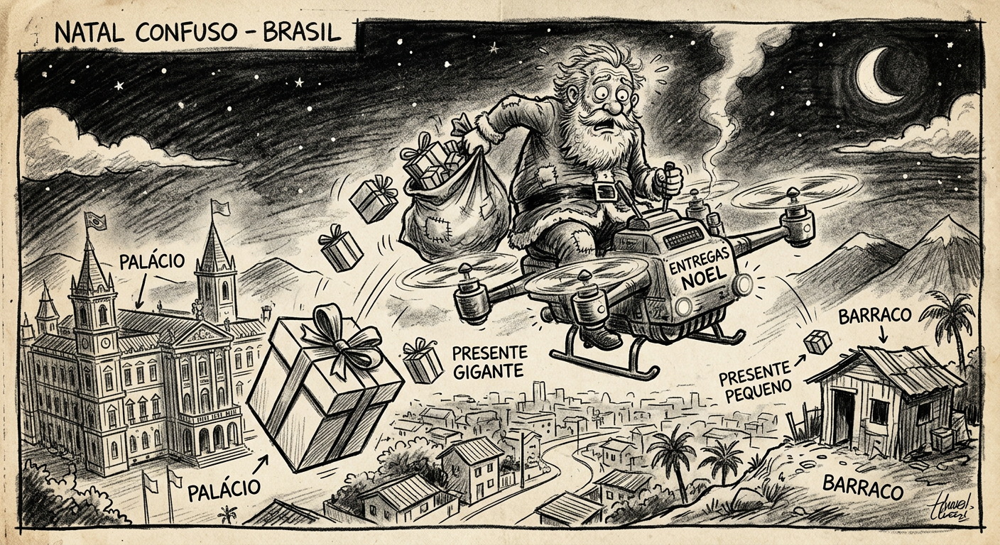

Lembro bem, deveria ter 8 anos. Ganhei do Papai Noel um bibelô de porcelana. Era um cachorrinho de não mais de 4 centímetros. Guardei-o por muito tempo. Fiquei muito feliz. Papai Noel lembrou de mim e também dos meus irmãos. Ir à igreja e ver o presépio era maravilhoso. Um dia descobri que não havia Papai Noel e que aquela data era para comemorar o nascimento de Jesus. O presépio fazia todo o sentido. Descobri depois que o presépio foi uma invenção de São Francisco de Assis e que a Bíblia não fala de boi e jumento — e que eles foram colocados em cena com o propósito de atazanar os judeus.

Mas tudo bem, Natal é Natal. De repente descobri: Jesus com certeza não nasceu em 25 de dezembro e, pior, ninguém sabe quando foi.

Certo é que no ano 354 d.C. o papa Libério ordenou que os cristãos celebrassem o nascimento de Yeshua no dia 25 de dezembro. Provavelmente ele escolheu esta data porque em Roma já se comemorava neste dia o dia de Saturno — a festa chamada Saturnália. Por seu turno, a religião Mitraica dos persas (inimiga dos cristãos) comemorava neste dia o *NATALIS INVICTI SOLIS*, ou seja, "O Nascimento do Sol Vitorioso". Temos então que, por decreto, o aniversário de Jesus passou a ser 25 de dezembro — uma data simbólica. Afinal, alguém que mansa e pacificamente deflagrou uma revolução que se prolonga por dois mil anos merece uma data para celebrar seu nascimento.

Diz o ditado: *"É o uso do cachimbo que entorta a boca."* Os cristãos não abandonaram por completo os festejos das Saturnálias, onde se distribuíam presentes como vinho e guloseimas. Mais tarde um senhor muito piedoso, chamado Nicolau, teve a ideia de nesta data distribuir brinquedos para as crianças pobres.

A essas alturas nem precisa explicar que o comércio e a indústria se apropriaram da data para incrementar suas vendas. Deu no que deu. Papai Noel não passa de um velho bizarro, guiado por um *"dronener"* que sai distribuindo presentes nos palácios, nas casas e nos barracos — tudo de acordo com a classe social do presenteado.

Que saudade do meu cachorrinho de porcelana.

---

> *Anoiteceu, o sino gemeu*\
> *A gente ficou feliz a rezar*\
> *Papai Noel, vê se você tem*\
> *A felicidade pra você me dar*\
> *Eu pensei que todo mundo*\
> *Fosse filho de Papai Noel*\
> *Bem assim felicidade*\
> *Eu pensei que fosse uma*\
> *Brincadeira de papel*\
> *Já faz tempo que eu pedi*\
> *Mas o meu Papai Noel não vem*\
> *Com certeza já morreu*\
> *Ou então felicidade*\
> *É brinquedo que não tem*

*Assis Valente, 1932 — num quarto de pensão em Icaraí, Niterói.*
