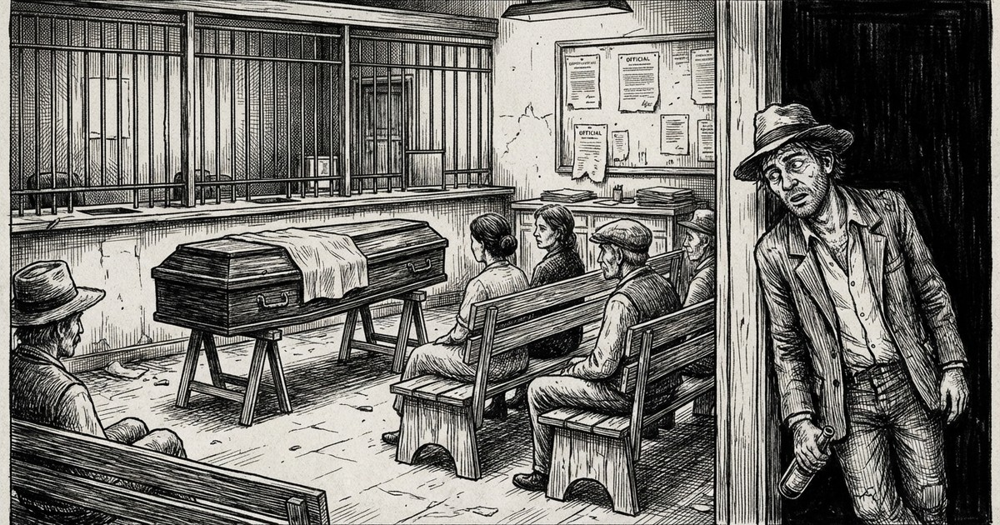

Era a única agência bancária da cidade. Gente chegando e abrindo negócios de todo o tipo. Por vezes apareciam depósitos em sacos de estopa. Pobres dos funcionários — trabalhavam até a meia-noite datilografando, preenchendo fichas e controles. O gerente de cabelos grisalhos tudo supervisionava, além de à noite ter que comparecer nas rodas sociais, normalmente regadas de "disques e uísque falsificado". O stress e o cansaço eram visíveis.

A cidade tinha um comércio efervescente, a concorrência entre os secos e molhados era grande. Com destaque para o setor de vestuário e armarinhos. Duas lojas disputavam a hegemonia. Anúncios com carros de som e desfiles pela cidade empoeirada chamavam a atenção da freguesia, carente de tudo e sem dinheiro.

## A Notícia

Uma certa manhã, quando o comércio se preparava para abrir as portas, alguém avisou que o gerente do banco sofrera um ataque cardíaco fulminante e acabara de falecer. A notícia era trágica e relevante — deveria ser anunciada.

O meio de comunicação era pelos alto-falantes móveis, fixados no teto de um veículo. De pronto um comerciante passou a anunciar respeitosamente o triste acontecimento. O povo que já esperava na porta do banco ficou atônito. O que fazer? Como seria? Não havia nem mesmo quem pudesse decretar feriado.

Com o intuito de contribuir com a comunidade — e ao mesmo tempo demonstrar força —, o outro comerciante, que era nordestino da "Gota Serena", acionou as cornetas com potência total e passou a anunciar pelas ruas da cidade:

— **Espetacular notícia! Acaba de falecer o Gerente do Banco! O velório será na própria agência, mas o banco vai estar fechado.**

## O Velório no Banco

Consternados, os clientes que já faziam fila na porta foram aos poucos se dispersando. Não demorou e chegou o féretro. As portas do banco se abriram. Em frente aos caixas foram realinhados os bancos de espera.

A boca miúda, cochichos:

— Logo hoje que eu iria receber uma ordem de pagamento. E eu que ia falar com ele para segurar meu cheque pré-datado. Veja como são as coisas. Ele era gente boa. Que Deus o tenha.

Naquilo entra o contumaz cachaceiro:

— E morreu mesmo?

— Psiu! Cala a boca!

— Cala a boca já morreu. Eu... não devo nada pro banco nenhum — só quero saber quem morreu!

---

Foi nesse dia que a cidade parou — porque o gerente não estava lá.
