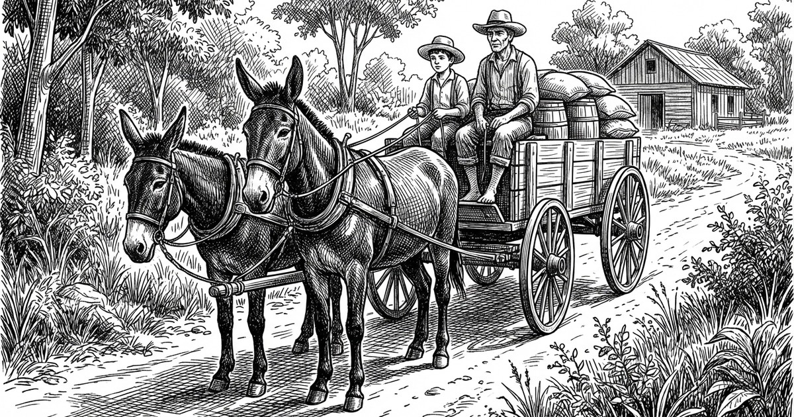

Era primavera, já quase de verão.
Para atender a demanda de fim de ano,
Mandou o guri e um vaqueano.

A carga era pouca; coisa do dia a dia,
farinha, rapadura, fumo, latas de banha
E de quebra uma barrica de boa canha.

Distância de apenas uma jornada,
O piá, tem que ser falquejado,
porque anos lhe bate no costado.

O tempo dá o traço e o traquejo.
Na vida o que se aprende primeiro
É o desenleio do pialo e o tiro certeiro.

No passo a passo, não se judia o animal.
O piá na boleia e o compadre de vaqueano.
E tudo estará bem no final de ano.

A tarde caindo e o sol já se escondia.
Por volta, muito mato e pouca gente.
Por vezes um rancho ou um vivente...

Quando se viu o luzeiro da freguesia.
Marcar a presença e pedir um pouso
E boia se não for muito custoso.

Recomeço da jornada no clarear do dia.
Ajeitar a carga, a começar pelos corotes
Ovalados, desajeitados e sem suporte,

Muito apreciado o seu conteúdo.
Cachaça da boa é arte e segredo.
Firma o pulso, espanta o frio e o medo.

Por causa dela até me desviei do causo.
Não é benta, mas é um santo remédio.
Anima a alma e espanta o tédio.

Pra que pressa, tem que fazer rodeio.
É no floreio que a história é contada.
Tudo arrumado para reiniciar a jornada.

Atento, não se sabe onde o perigo mora.
O guri mostrou ser guapo e seguro;
No descampado no claro e no escuro.

Embolado na moita feito velhaco.
Para contar o causo do jeito certo
Me aprumo para mais uns versos.

Conforme dizia: o perigo não tem endereço.
Ronda por aí, andejo e esquisito;
Provoca entreveros, e enguiços.

De repente na moita a beira da estrada...
Um vespeiro, e daí o causo muda.
Ouve um espanto, foi um Deus nos acuda.

Na disparada voou cachaça e rapadura.
Junto foi o vaqueano se esfolando na pedreira
mas o piá ficou firme segurando a regeira.

Cai fora que não tem mais jeito!
De longe, gritava o vaqueano.
E lá se foram os sonhos e os planos.

Montado num burro e puxando o outro.
Tristonho esgualepado, disse do acontecido.
Foi triste, por sorte não ter morrido.

E o vaqueano ficou juntando os cacos.

— Cuidemos dos vivos — disse o bodegueiro.
