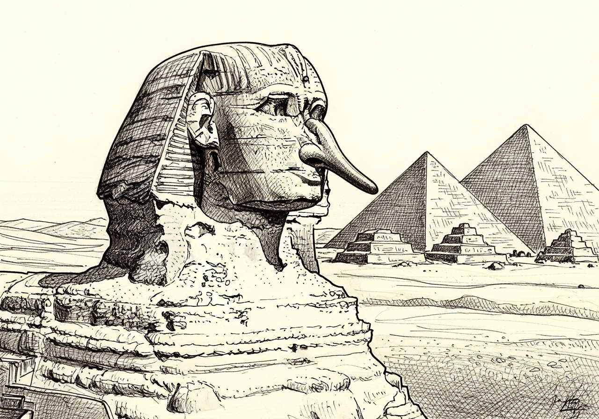

Há quem diga que a história do mundo seria outra, caso Cleópatra tivesse nariz diferente. Não sei como era o seu nariz e nessa questão não meto o meu bedelho. Não existe fotografia de Cleópatra, mas é de se imaginar que ela não era da dinastia egípcia e tampouco de descendência etrusca. Tinha com certeza um nariz redondinho, bem diferente ao de Marco Antônio — que possivelmente era um baita narigudo, tanto é que foi meter o nariz onde não lhe dizia respeito.

O nariz não possui apenas a função olfativa. Todos cheiram, uns bem, outros nem tanto, mas não é culpa do nariz. Talvez tenha função de direcionamento — todavia, é de bom alvitre ficar atento para onde ele aponta, para não sermos aconselhados a cuidar dele.

Por vezes serve para revelar uma postura de caráter, notadamente quando ele se mostra empinado. Não por acaso que Monteiro Lobato criou a personagem Narizinho, a menina do nariz arrebitado. Lembrando que no Sítio do Pica-Pau Amarelo ela estava sempre causando confusões.

Torcer o nariz pode significar discordância — mas discordar é um direito. Neste caso, cada qual que cuide do seu.

Cientificamente existem vários tipos de nariz: grande, pequeno, longo, curto, reto, curvo, adunco, romano, aquilino — ou, maldosamente, nariz de bruxa. Tem também o nariz de caçapa. Cada qual com o seu, que aponte para onde bem entender. Bem interessante é o nariz de palhaço: provoca alegrias, oculta tristezas, e mais das vezes revela a verdade.

O mais emblemático nariz foi o de Pinóquio, que crescia sempre que faltava com a verdade. O sonho de Gepeto era que seu boneco tivesse o nariz igual ao de todas as crianças. Bom seria se todos tivessem um nariz politicamente correto.

Chamem-me de narigudo, mas não de mentiroso. Gepeto era apenas o personagem criado por Carlo Lorenzini — ou simplesmente "Collodi" —, comediante italiano que em 1848 lutou com Garibaldi pela unificação da Itália. Diga-se de passagem que o verdadeiro narigudo era Giuseppe Garibaldi, que veio meter seu nariz no Brasil, consagrando-se assim como o "herói de dois mundos" — e daqui levou nada mais nada menos que Anita, uma mulher sem precedentes na história, que pelo visto tinha um nariz mui formoso. Um autêntico nariz tupiniquim.

Difícil mesmo é entender que o tamanduá tem um nariz nada discreto. Dessa forma consegue ver o que está na sua frente.

George Orwell teria dito: *"Ver aquilo que temos diante do nariz requer uma luta constante."*

O escritor brasileiro Erico Veríssimo questionou: *"Será que um dia não vai haver mais em toda a Terra um lugar onde um homem possa ser dono pelo menos do seu nariz, dizer o que pensa, ter uma cota razoável de liberdade? Talvez em alguma ilha deserta do Pacífico."*

Monteiro Lobato afirma, em sua obra, que o nariz é o fator determinante da personalidade: gostar do habitat natural, ter diálogo e ser confidente. No mais, que digam os narisólogos.

