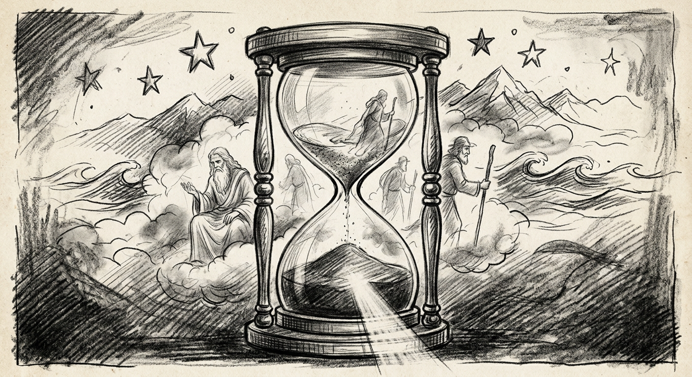

Nas arestas do tempo,\
Nas dobras do vento,\
Na memória distante,\
No agora, no instante;\
Vejo lutando ao relento\
Sem trégua e lamentos,\
Míticos sábios arcontes;\
Na busca do gene e da fonte.\
Nas longas jornadas ardentes,\
O mundo nunca foi diferente.\
Trilhas e caminhos estreitos,\
Mar, terra, rios e montes;\
Desertos, floras e fontes.\
Antes nada havia.\
Do nada, a luz.

