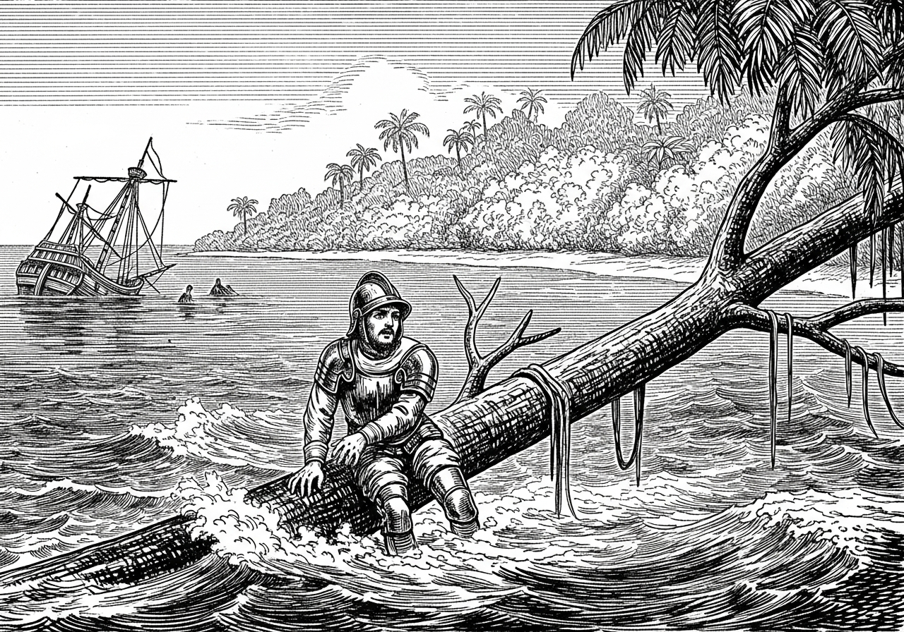
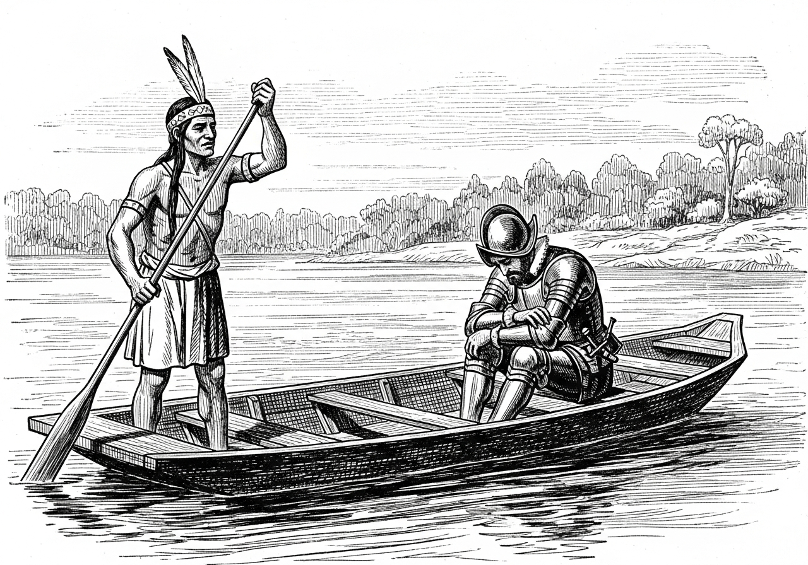
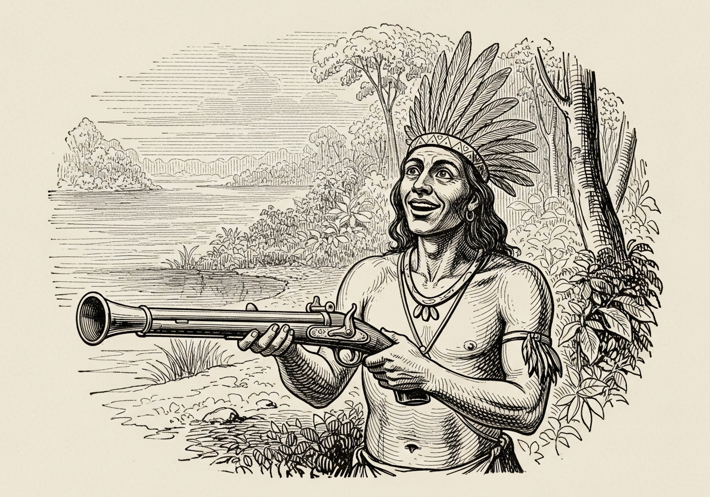

No primário, além de lendas dos bandeirantes, como de Borba Gato, disseram-me que o primeiro que se atreveu atravessar território Paranaense de leste a Oeste foi o espanhol Núñez Cabeza de Vaca. O que se sabe é que em 1544 o capitão espanhol Domingo Martínez de Irala foi proclamado governador do Paraguai, após prender Núñez Cabeza de Vaca, sujeito que havia se apoderado do posto de mandatário da então espelunca que surgia à margem do Rio Paraguai a qual veio a se tornar a belíssima cidade de Asunción.

Até então não existia a província do Paraguai, tão pouco o Paraná. Tudo era terra de ninguém ou dos índios nativos e que pouco a pouco foram dizimados pelos conquistadores. Segundo Darci Ribeiro, mais de um milhão deles existiam pelo Brasil, espalhados e agrupados e com suas culturas diversas.

O tratado de Tordesilhas partilhou as terras do Novo Mundo entre portugueses e espanhóis, sem plebiscito ou audiência pública, tudo assim na mão grande, na cara dura e com as bênçãos da Santa Madre Igreja Católica Apostólica Romana.

O continente americano já tinha um povo de elevada organização sócio-política, tanto é que ingenuamente, interagiram com os conquistadores. Daí, já viu. Saíram pelados com as mãos no bolso.

O causo do momento é sobre um sujeito batizado por Alvar Nunes Cabeza de Vaca, ou simplesmente, Cabeça de Vaca.

Os registros dão conta de um aventureiro conquistador que nunca conquistou nada. Explico: Sua saga de conquistador teve início na América Central, porém por lá se deu muito mal. Hernan Cortes já havia fincado o pau da bandeira por lá. Mesmo assim o infeliz não se deu por derrotado, pudera, era "pau mandado" da decadente nobreza e crescente burguesia espanhola abençoadas pela cúria romana e assim fez nova expedição, dessa vez para a América do Sul. Sua missão era encontrar ouro e prata. Ficou sabendo que Francisco Pizarro já tinha passado o rodo e levado o ouro dos Incas. Mesmo assim montou uma estratégia. Chegaria aos Andes pelo outro lado. Costeando as terras pertencentes aos portugueses chegou na parte sul, Cananeia, mas ali já tinha um Certo Bacharel, bem ambientado e que apenas lhe passou algumas informações por ouvir dizer.

O dito Bacharel de Cananeia foi um degredado português e posteriormente traficante de escravos, intérprete e guia de navegação. Foi levado para o Brasil, no litoral sul do atual estado de São Paulo onde passou a viver entre os indígenas carijós. Foi apalpando, foi apalpando até chegar na Baía de Babitonga, Ilha de São Francisco. Porém diz a lenda que por ali naufragou tendo perdido duas ou três naus, homens e cavalos, mas conseguiu se salvar nas calmas águas da baía.

Enquanto pensava na vida, ficou por ali conversando com os índios Carijós, senhores da região, até que um dia chegou ali na praia um índio com panca de cacique, sujeito de boa lábia, tipo Silvio Santos, que "ablava espanhol, pero no mucho" e cochichou na orelha do mui ilustre Cabeça de Vaca apontando para a floresta: "mucha plata".

De pronto Cabeza de Vaca arregalou os olhos, consultou o mapa de Piri Reis que estava guardado no fundo do baú e após minucioso exame concluiu que poderia se apoderar da "Tierra de los Mojos", sem ter que passar por Buenos Aires, até mesmo porque não apreciava tangos e milongas.

Mas o combinado não é caro. Paraguá reuniu tudo o que era índio que tinha por ali e, devidamente armados de tacapes e zagaias, partiram de mala e cuia. Na verdade, levavam a cuia posto que a mala era o Cabeza de Vaca, um verdadeiro mala sem alça.

O problema era encarar a mata. Cabeça de Vaca já tinha levado uma esfrega no deserto do México, portanto estava meio "veiaco". Topou porque o cacique disse que conhecia muito bem o caminho. Acontece que mal conhecia um pedacinho da Trilha de Peabiru que subia a serra e se estendia para o infinito da floresta.

Subiram a serra, e nas nascentes do Rio Iguaçu construíram alguns caícos de garuva e se atracaram rio abaixo. Foi quando Cabeça se viu no mato sem cachorro, mesmo porque se quer "cusco" tinham. Havia muito cachorro do mato que Paraguá chamava de graxaim.

Quando já pensavam estarem no fim da viagem embocaram na correnteza e despencaram nas cataratas. Foi um "Dios nos acuda". Cabeça de Vaca, vendo novamente a viola em cacos, exclamou: "Salve-me Jesu Cristo, que lhe darei dez por cento de toda la plata que conquistarei!" Conseguiu se agarrar num galho de sarandi e ali ficou pendurado berrando feito bugio, balançando dois pra cá e dois pra lá; bem no estilo gauchesco. Ao seu lado estava seu fiel escudeiro Paraguá que, antevendo a desgraceira, pulou do barco e por sorte se agarrou numa taquara, subiu a barranca para acudir o "mala sem alça".

Passado o susto, Cabeça de Vaca sentou-se numa pedra e ali permaneceu teso, abichornado, escutando o barulho da água. Sentiu-se tão azarado que se auto definiu como "esgualepado", ou seja, mal pago. Na verdade, o combinado entre Cabeza de Vaca e Paraguá não se deu por contrato registrado em cartório, portanto sem efeitos jurídicos.

Foi naquele momento de baixo astral que seu ajudante de ordens, Paraguá, catou folhas de uma planta, socou na cuia de pau — que acabara de resgatar entre as pedras —, misturou com água e deu para o chefe beber e, murmurou em perfeito tupi-guarani: "Te-Rê-Rê", ou seja, fica frio. Cabeça de Vaca já estava engrunhido de frio e ter que escutar palpite do índio desgraçado foi demais. O sangue ferveu na veia de Cabeça de Vaca, com vontade de esguelhar seu fiel escudeiro. Paraguá, liso como um serelepe, se embrenhou no taquaral e sumiu. Só voltou quando Cabeça de Vaca já estava rouco de tanto gritar. O índio apareceu de "esgueio", ressabiado. Ao vê-lo, Cabeça de Vaca conversou: "E no se puede mas acer una brincaderita?"

No outro dia, no alvorecer, Paraguá começou a juntar os cacarecos e recarregar o caíco que ficou encalhado entre as pedras. Tudo ajeitado, partiu rumo à tríplice fronteira, que até então era conhecida por "curva de rio". Acontece que Cabeça de Vaca ainda estava meio tonto com tanto barulho de água e determinou: "Adalante!"

Seguiram remando e perceberam que estavam num outro rio cujo nome desconheciam. Então, em homenagem ao seu obstinado ajudante, Cabeça de Vaca o denominou de Rio Paraguai. Por ele subiram até chegar numa espelunca onde encontraram alguns castelhanos. De cara foi lhe exigido uma propina, aliás coisa normal naqueles tempos. Como não tinha nenhuma "plata", penhorou a única ceroula que lhe restara, coisa mui útil para aquele tempo.

Foi recepcionado por um indivíduo conhecido por Mendoza. Mesmo não sabendo onde estava, Cabeça de Vaca deu uma de "João sem Braço". Percebendo que o anfitrião era um zé ninguém, disse que estava ali por ordem do Rei e assim se intitulou chefe da zona, quer dizer da região, e por ali ficou cantando guarânias.

Passados uns dias, Mendonza perguntou:
— Don Nunhes Cabeça de Vaca; que quieres usted a lá cá?
— La Plata! Donde está la plata?

Mendonza apontou para o norte e disse: "No se puede, es mui peligroso"; ao que Cabeça de Vaca retrucou: "Posso si!" Paraguá, que não entendia patavinas do que os dois discutiam, deu uma risadinha e murmurou: "POTOSI".

Numa bela tarde, Cabeça de Vaca estava navegando pelas águas serenas do Rio Paraguai quando deu de cara com uma chalana onde um sujeito com cara de poucos amigos lhe esfregou no nariz um "catatau" assinado por El Rei da Espanha e meteu um pé na bunda de Cabeça de Vaca, mandando-o à lá cria, para nunca mais querer conquistar bulhufas.

*...e a chalana foi sumindo na curva do Rio.*

Para não dizer que foi um completo azarado, retornou à Espanha feito prisioneiro sob a acusação de improbidade administrativa, mesmo sem prova alguma. Ficou quinhentos e quarenta dias preso, mas depois foi libertado e teve seu processo anulado. Ainda tentou reconquistar o prestígio de outrora, mas não teve apoio. Ficou até com medo de sair na rua. Virou monge onde escreveu suas memórias, convicto de sua honestidade. Não demorou e bateu as botas. Enquanto monge, examinou documentos oficiais e acabou por descobrir que o cara que estava na proa da chalana não tinha competência alguma, razão pela qual seu processo foi anulado.

Especula-se também que tenha navegado pelo Rio Amazonas e Rio Madeira onde foi barrado por uma cachoeira, então atracou num antigo porto já utilizado pelos índios. Malditas cachoeiras que o impediam de chegar por águas no interior da Bolívia. Atracou por ali um tempo e depois se mandou para o sul, onde naufragou na entrada da Baía de Babitonga, onde encontrou os Karijós e seu fiel escudeiro Paraguá.

Cerca de trinta anos depois de Cabeza de Vaca ter descoberto as cachoeiras do Rio Madeira, também conhecidas por cachoeiras do Teotônio, outro espanhol conhecido por Nuflo de Chaves teria relatado a existência das cachoeiras do Rio Madeira. Esse espanhol atracou num antigo porto de uso dos índios Caripunas e denominou de Porto Velho. Ali encontrou uma lamparina ainda acesa deixada por Cabeça de Vaca, bem na foz de um rio que passou a se chamar Candeias por conta do lampião deixado por Cabeça de Vaca.

O nome Cachoeira do Teotônio se deve a um português aventureiro que, por volta de 1750, fundou a primeira vila no local hoje conhecido por Porto Velho. Esse tal de Teotônio, que na verdade era paulista, é uma história à parte. Podemos adiantar que navegou pelos rios da Amazônia e também no estuário da Prata; dizem que foi cofundador da Vila Bela da Santíssima Trindade no Mato Grosso, juntamente com Don Antônio Tavares de Rolim de Moura, conde de Azambuja.

Moral da história: o tal Cabeza de Vaca quase deu uma volta ao mundo para, em Asunción, levar um pé na bunda. Um verdadeiro CABEÇA DE VACA.

Quanto ao Cacique Paraguá, depois dessa experiência mal sucedida decidiu dar uma parada. Tendo retornado com Cabeza de Vaca sem direito algum, nem mesmo ao trabuco que tanto sonhara ao chegar nas nascentes do Rio Iguaçu, decidiu ficar por ali. Ali havia muitos pinheiros e um rio piscoso que o denominou de Piraquara. Por ali pescava, colhia pinhões, estaqueava couro de veado e quando seus conterrâneos, os Carijós, subiam a serra pela Trilha de Itupava, trocava por sal, chumbo, pólvora e até um trabuco. Aquele mesmo do Cabeza de Vaca, que ao embarcar esqueceu o mesmo na beira da praia.

Diz a lenda que nunca mais voltou para a Baía de Babitonga, com receio de ser esfolado pelos parentes que restaram na região. Acabou se acostumando com o clima frio e úmido da terra das araucárias. Quando entediado, olhava para o pico das montanhas da Serra do Mar, onde havia um morro bem alto. Fitava o morro e gritava "anhangava", que significa morada do diabo. Paraguá morreu de velho e, por óbvio, sem atestado de óbito, posto que não tinha cartório de registro.

De acordo com Rafael Greca, a câmara de vereadores de Piraquara estará aprovando um monumento em homenagem ao índio Paraguá, que sem sombra de dúvidas foi o primeiro habitante da região.

*O Paraguá com o trabuco — o sonho finalmente realizado.*
