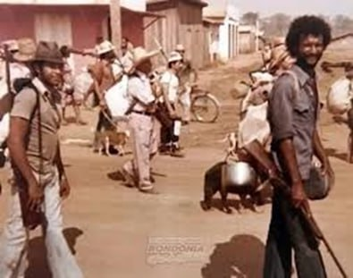

Saco nas costas, espingarda a tiracolo e foice na mão. Essa é a expressão que define o cacaieiro — o verdadeiro desbravador das matas de Rondônia. Não era só uma forma de trabalhar, era o uniforme de quem ia pra mata enfrentar o desconhecido.

A mata não era pra amadores. O cacaieiro entrava com o essencial para a sobrevivência e para a lida, enfrentando o mato fechado, a incerteza e a força bruta da natureza. Cada passo era uma conquista, cada roça aberta, uma vitória contra o tempo e o isolamento.

## Os Heróis Anônimos

Milhares de pessoas abriam clareiás na mata, alojando suas famílias em barracos e davam início às lavouras de arroz, feijão, café e pastagens. Esses heróis anônimos se embrenhavam na floresta em grupos de até dez pessoas carregando ferramentas, utensílios de primeira necessidade, foice, fação, espingarda e cartuchos carregados. Na mochila: sal, açúcar, café e farinha para os dias na mata.

Ganharam o apelido de cacaieiros, porque na verdade o que carregavam eram cacos, como panela velha, rede para dormir, sal, açúcar, café e farinha, e até cachaça da boa.

---

É uma honra registrar essa parte da história, seu Adi. O senhor sempre diz que "o que não se escreve, o vento leva", e esse povo que carregou o progresso nas costas merece ter sua saga preservada nos nossos alfarrábios.