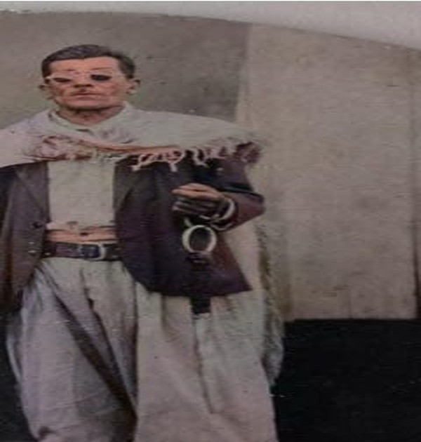
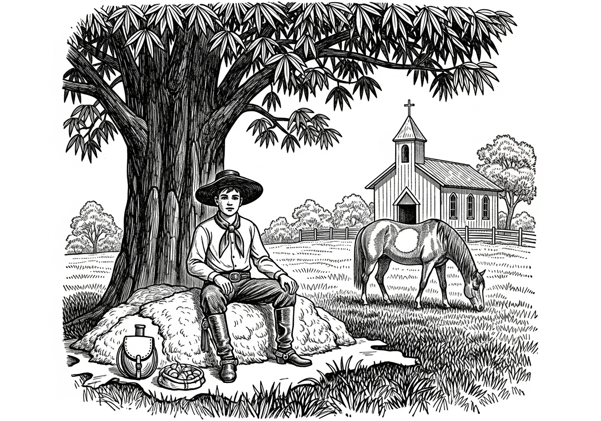
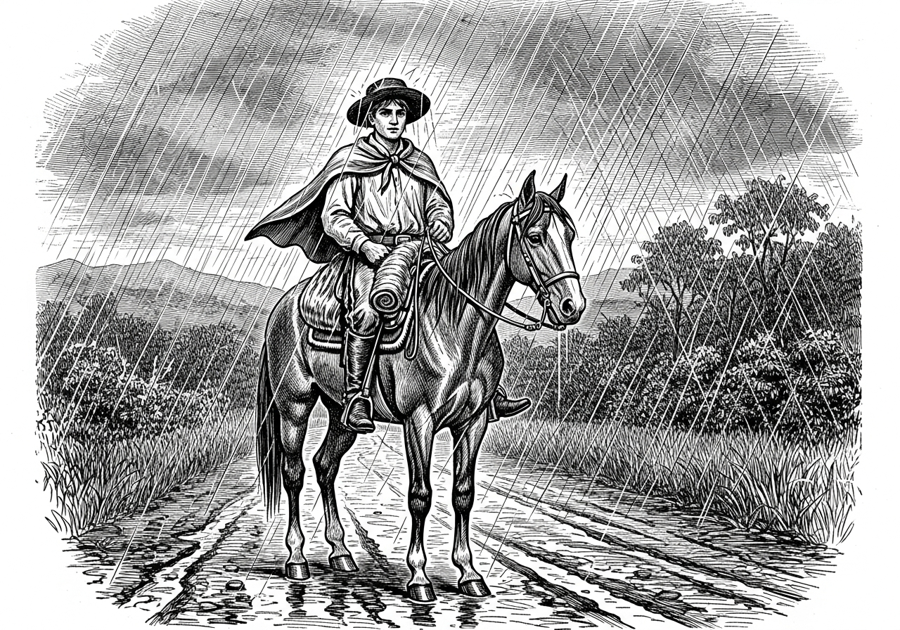
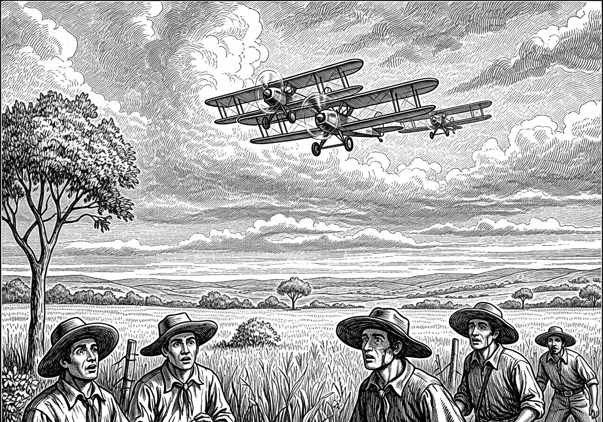
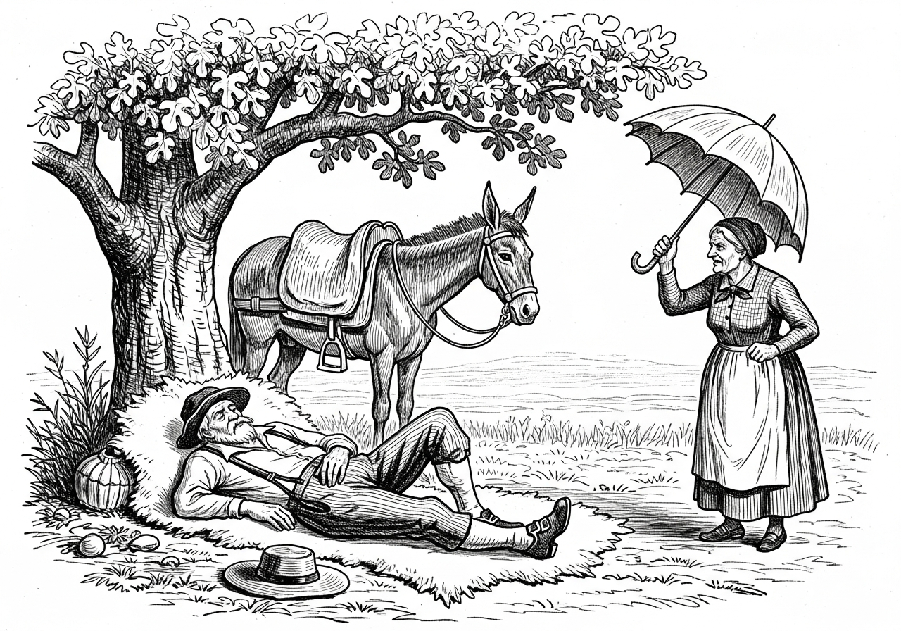

*Cinco causos do gaudério Franquelim da Silva Portela — o homem do pala cinza com orla preta, da mula baia e das histórias que a coxilha guardou por décadas.*

---

## Um gaudério fora de seu tempo

Eu o conheci quando menino, em 1956. Gaúcho, nascido e criado nos campos de Soledade. Já passado dos sessenta, migrou para o Paraná. Como veio não sei — acredito que como tantos outros, pelas trilhas abertas pelos ervateiros e outros migrantes. Comboios de carroças, acampando nas beiras de sangas, sesteando na sombra das árvores e repontando alguma tropita. Família grande, moças e rapazes.

*Vovô Franquelim — o gaudério das coxilhas.*

Instalou-se no interior do município de Pato Branco. Um lugar onde quase nada havia, apenas uma serraria e começo de roças. Lembro do dia. Era dia santo, por volta das três da tarde. Mamãe levava um guri no colo e outro na barriga e, meio me empurrando, disse: — Peça benção do teu vô. Estendi as mãos juntas e ouvi a resposta: — Deus te abençoe. E foi só. Guri educado não se mete em conversa de gente grande.

Tenho na memória o seu tipo. Alto, cabelo liso e grisalho, bota, chapéu de aba larga. Nem sempre usava bombacha e sim calça de brim bem folgada e uma guaiaca de couro de anta com fivelas de prata. Faca na cintura, sempre no jeito para picar o fumo de corda e aparar a palha. Em casa, um "faisqueiro" dos antigos para acender o pito — combuca de porongo, tocha de algodão que acendia pelo atrito de um pedaço de ferro e uma pedra de quartzo. Semblante sério, porém camarada, prestativo e ao mesmo tempo caçoador. Tudo servia para puxar uma prosa e contar um causo. Mamãe contava muitas de suas histórias.

Circunstâncias da vida. Uns vão para um lado e outros para outro. Quando o vi pela última vez, eu já tinha dezesseis anos. Cheguei solito no cavalo alazão. Quando me viu, já chasqueou: — Esse piá tem a cara do pai dele! A visita era pra saber de sua saúde. Estava doente, acamado. Uma cirurgia mal sucedida e tinha que usar bolsa de colostomia. Por vezes conversava, por vezes gemia. Após um silêncio, olhando-me com semblante tristonho, falou:

— Estou aqui deitado sem poder fazer mais nada. Às vezes parece que estou cavalgando pelos campos com o pala soprado pelo vento e vendo o revoar dos quero-queros, mas quando me dou conta estou aqui. Veja aí meu chapéu e a guaiaca sem serventia. Quando faz um friozinho me cubro com o pala, que já não passa de um trapo mijado. Acho que a finada Amantina, tua vó, deve estar me esperando com a cuia na mão. Logo bato o pé na soleira e me apresento.

Saí com os olhos lacrimando e compreendendo a realidade da vida. Não demorou mês e ele partiu pro rancho eterno. Passados quarenta anos, visitei o túmulo. Um cemitério abandonado com algumas cruzes de madeira corroídas pelo tempo, sendo impossível qualquer identificação. Deixou uma geração e muitos causos.

---

## A última campereada

Já descrevi o tipo do Vovô Franquelim. Do pouco que com ele convivi (1956–1967), na fase de guri, guardei muitas lembranças. Impossível relatar com precisão, assim, valho-me da verve para compor crônicas e causos, o que sem dúvida retratam realidades vividas. Sem falsa modéstia, guardo *recuerdos* da infância e das minhas andanças pelo Sul e pelo Norte.

Quero cá dizer que, dos doze irmãos, tive a oportunidade de ver Vovô Franquelim em seus últimos dias. Era um sábado, último dia do ano. Tinha eu dezesseis anos, já na trave dos dezessete. Estava de férias. Mamãe disse: — Vai saber do vovô, que sei que não está nada bem. Por que eu? Porque naquele momento só poderia ser eu.

Encilhei o cavalo alazão pela manhã e parti da beira do Lajeado a Bonito, onde morávamos. Atravessei os rios Santana e Marrecas na pequena balsa e trotei. Passei pelo Joaquim Barriga Verde, Seu Vergílio, também conhecido por "Vergílio Costela" — diziam que tinha esse apelido por conta de um trato que fizera: dá peleia, quem vencesse deveria tirar a costela do outro, assar e comer. Vergílio cumprido a promessa e ganhou o alcunha, um apelido no mínimo curioso.

Subi a serra passando pela Vila Belé e depois pelo picadão até a estrada do Verê. Até aí eu conhecia. Havia percorrido essa estrada muitas vezes para ir nos moinhos, montado no burro Macaco, levando milho ou trigo — isso quando eu tinha dez anos.

Em Alto Verê, na encruzilhada, segui rumo Maracajá. O cavalo era bom, mas o sol estava de rachar. Por volta do meio-dia cheguei na Boa Esperança.

*O sesteio na Boa Esperança — pão, queijo, salame e o balde pingando água fresca.*

Sesteei na sombra de um cinamomo ao lado da igrejinha. Desencilhei o cavalo que já estava lavado de suor. O Alazão se espojou na grama e começou a pastar. Sentei sobre os pelegos para comer a merenda que mamãe havia colocado no pessuelo. Pão, queijo e salame. Ao lado da igreja tinha um poço, um balde e uma corda — acho que mais de cinco metros. O balde subiu pingando água fresquinha. Bebi uns goles e o resto dei pro cavalo. Bebeu todinha.

Prossegui a viagem. Faltava ainda um bom trecho. Muita pedra brotando do chão. A marcha era lenta. Os morros estavam ponteados de roças de feijão e milho. Perto das casas, potreiros e encerra de porcos. Galinhas soltas no terreiro. Por vezes alguns guaipecas latiam, o que forçava o trote.

Em certo trecho da estrada, fiquei na dúvida numa encruzilhada em forquilha. Mesmo na dúvida, fui no palpite. Não demorou, avistei alguém montando num cavalo baio. No encontro, erguendo a aba do chapéu, pedi informação. — Sim, é por aqui. Eu estava certo.

Para quem já tinha troteado mais de vinte quilômetros, já estava chegando. Foi quando uma nuvem de verão se formou e caiu água.

*"...e a água escorria pela aba do chapéu de feltro."*

Estendi a capa que estava na garupa e a água escorria pela aba do chapéu de feltro. Segui sentindo o zunido do vento e ouvindo o *ploc, ploc* das patas do cavalo pisando no barro. Foi só um aguaceiro. Logo a chuva parou e o sol voltou a brilhar. Já beirava as três horas quando cheguei no Empossado.

Ali, Tio Alaíde tinha uma bodega. Mal chegando, me reconheceu: — É um piá do compadre Vitório, falou pra Tia Maria que estava na cozinha.

Informando das coisas, mostrou não estar contente. Tio Vitório Faré insistia que Vovô ficasse na casa dele, mas Tio Alaíde queria que ficasse na bodega, sede do povoado. Não houve acordo. Vovô ficou na casa de Tio Vitório Faré.

Nessas alturas, Vovô já era viúvo. Vovó Amantina havia falecido não muito tempo antes. Com ele morava Tia Aurora, a Lola, e Tio Geremias, o caçula — mais folgado que garrão em chileno de couro.

*'Buenas'*, todo o causo tem que ter um fim. Encerro dizendo que ali conversei com Vovô e ouvi lembranças e saudades dos filhos espalhados. Pareceu-me que o que ele mais gostaria era vê-los todos reunidos, mesmo que fosse só para tomar umas cuias de chimarrão e comer uma galinha ao revirado.

Era dia primeiro do ano e um domingo. Encilhei o Alazão e me bandei. Apertei o passo. Tinha que levar o "RECADO A GARCIA". Dizer pra mamãe que o Vovô não estava bem.

Na subida da Boa Esperança, percebi que o cavalo estava muito suado. Apeei na sombra de um pé de "soita", espalhei os arreios e deitei no pelego. Não deu tempo para nada. O cavalo bufou e espichou o cabo do cabresto, espantado. Olhei ao redor e vi a colônia de formigas *correição*. Acudi o cavalo, para depois buscar os arreios e os pelegos já impregnados das terríveis formigas. Foi uma luta, mas me virei.

Cheguei na Barra do Marrecas, na casa do mano Ari, exausto, com sede e esfomeado. O mano Darci — aquele que foi gerado no Rio Grande e parido no Paraná em 1956, agora com oito anos — montou o Alazão levando-o para beber na sanga. Comi o requento do meio-dia e saí logo em seguida. Faltavam só dois quilômetros.

Cheguei. Só estava mamãe, os demais tinham ido pra reza. Quando me viu entrando na porteira com o cavalo suado, quis saber das notícias. Contei. Entre lágrimas, balbuciou: — Eu sabia.

Deitei amuado. Trotar mais de sessenta quilômetros não é serviço pra piá.

Não demorou muitos dias e veio a notícia: Seu Franquelim da Silva Portela havia falecido. Foi sepultado no cemitério do Empossado, município de Dois Vizinhos.

---

## Negócio da Vaca

*"Encordoado nada, foi só dois. Um atrás do outro."*

Nos rincões do Rio Grande, de légua em légua sempre havia um bolicho para a venda de cachaça, fumo e coisas de precisão nos ranchos e estâncias. Por ali se encontravam e se reuniam peões e estancieiros, tratavam de negócios, combinavam carreiradas e fandangos.

De uma feita, mais pela tardinha, seu Franquelim apeou por ali e deu boa tarde para os presentes. Ali estavam alguns gaudérios *abichornados*. Parecia um velório. Só faltava o defunto. Sem rodeios, perguntou se tinha morrido alguém.

Parecendo ter acordado de um cochilo, um dos viventes se aprumou: — E "vois mece", não viu os teco-tecos de manhãzinha? Acho que é a guerra que tá chegando por cá.

Seu Franquelim viu de cara que dava pra aprontar uma das suas. — Que guerra que nada, amigo Gaudêncio. Estou sabendo há três "ontonte". Desde o dia em que o padre esteve aí pra fazer os batizados. Inclusive do Veridiano que já tá querendo "casá" e ainda não tava batizado.

— De fato veio, mas e daí? Como diz o ditado, "o que tem a ver o cú com a calça?" Tamo preocupados com os teco-tecos que passaram bem rente às copadas das árvores, hoje cedo.

— O que tem a ver um com o outro, não sei bem, mas acho que só o peido. Eu leio "jornár", seu Gaudêncio, quando posso — é verdade, porque nem sempre tem. Dessa vez o padre esqueceu um jornal *Correio Riograndense* lá na capela, então levei pra casa, até mesmo por causa da serventia: pra embrulhar alguma coisa, acender o "borraio" e também na patente, porque quando acaba o milho no "paió" o sabugo fica em falta e com grimpa de pinheiro é que não dá. Mas antes sempre leio as notícias.

— Mas então desembucha, homem, que o povo tá querendo saber desse troço de avião que passou encordoado!

— Encordoado nada, foi só dois. Um atrás do outro. *"Entonces"* como eu ia contando: tá escrito lá no jornal. O que sucede é o seguinte — o Dr. Getúlio vendeu uma vaca de cria para um estancieiro lá do Rio de Janeiro ou das Minas Gerais. E o combinado foi que o estancieiro das Minas vinha buscar a vaca. Foi por causa disso que vieram os aviões, rumo a São Borja.

*"Parado aí! Isso é patacoada e das grandes!"*

— Parado aí! Isso é patacoada e das grandes!, gritou o velho Gaudêncio.

— Só estou contando o que está escrito no jornal. E olha bem, seu Gaudêncio — o jornal foi escrito pelos padres, e padre não mente.

— Tá bom, apartou o velho Neco, estancieiro respeitado e desfazedor de encrencas. — Só quero saber: como vão manear a vaca no avião?

— Não vão botar a vaca no avião. Vão levar *repontada*.

— Te acalme, amigo Gaudêncio. Aí que tá o causo. Foi tudo bem combinado. Um avião vai de vaqueano e o outro vai repontando, tudo bem no estilo campeiro.

Só então que Aparício, abancado no canto enrolando o "criolo", assuntou que era só mais uma das patacoadas de seu Franquelim. E caiu na gargalha.

Gaudêncio, arrenegado, começou a soprar o bigode. Não fosse o velho Neco, a coisa podia ter virado entrevero de carreirada.

Seu Franquelim, pra contornar o acontecido, falou pro bodegueiro: — Bota um trago aí pro amigo Gaudêncio se "acarmar".

Nunca ninguém explicou o porquê dos dois teco-tecos. Dizem que tinham ido buscar o Getúlio para disputar a eleição de 1950. Apesar de não possuir o apoio da mídia, Vargas obteve a maioria dos votos.

---

## A Caçada de Onça

*"Mal clareou o dia, mais de trinta peões arrojados se achegaram com suas garruchas e cartucheiras, além da cachorrada barulhenta."*

A pampa se estendia pelas coxilhas interrompidas apenas pelos capões de mato, como se fossem sentinelas a observar a "gadaria" que crescia ao relento e ao sopro do minuano. No entre meio, os alarmistas quero-queros e discretas perdizes a ciscar no capinzal à cata de besouros e gafanhotos.

Toscos ranchos sustentados por esteios de guajuvira, cercados de taquara e cobertos com folhas de macega. Ao centro do rancho, o fogo de chão. Pendurada por uma corrente, uma panela de ferro onde fervia dia e noite a misturança de carne de queixada e feijão. Era a boia que sustentava o dia a dia dos viventes da lida campeira.

Sempre há um dia pra ser diferente daqueles que fazem a monotonia das coxilhas. Bibiano viu de longe e não gostou do que viu. O campo amassado e o rastro de sangue que já chamava o moscaredo. O animal fora arrastado e urubus já repousavam na copada das caneleiras. Num estalo, se bandeou para a estância. E foi explicando do acontecido.

Gaudêncio, o dono da estância, deu ordem pro capataz reunir a peonada. Mal clareou o dia, mais de trinta peões arrojados se achegaram com suas garruchas e cartucheiras, além da cachorrada barulhenta que chegava a espantar urutau em palanque de cerca.

Naquele alvoroço, se achegou seu Franquelim montando uma mula baia, num passo troteado. Sua velha cartucheira na garupa e uma dúzia de cartuchos na guaiaca.

O velho estancieiro gritou: — Por aqui, onça, mão pelada, leão baio e jaguatirica não se cria. Quero essa fera espichada no terreiro.

Seu Franquelim ficara solito no trote da mula baia, vendo a peonada sumir nos descampados. Chegou na beira de um pequeno capão rejeitado pelos peões. O sol estava a pino e o suor espumava na peiteira da velha mula.

A mula, de rédea solta, rumou pra beira da sanga para matar a sede. — Se a mula bebe, porque não eu. Apeou, desamarrou do arreio a velha caneca de prata, abanou a água e a caneca subiu pingando. Bebeu a se fartar.

Em seguida, colocou a cartucheira no chão e sentou-se na raiz da gameleira. Acendeu o pito e levantou a cabeça para a primeira baforada.

*"Ali estava ela, deitada, bem na sua frente, não mais de dez braças."*

Ali estava ela, deitada, bem na sua frente, não mais de dez braças. Como se fosse coisa do dia a dia, empunhou a cartucheira, firmou no peito, mirou bem na fuça. *Bumm...* Dentro do "zoio" e entremeio as orelhas. O bicho esperneou ali mesmo.

Já lhe veio na mente uma das suas. *Isso não pode ficar barato.* Puxou o facão e simulou a peleia. Sapateou até o mato ficar bem amassado. Até a toceira de urtiga ficou tosquiada. De quebra, deu uma meia dúzia de talhos na cara e no costado da fera. Esfregou um ramo de capim forquilha na "sangria" e, como se fosse o capelão na procissão do padroeiro, aspergiu o sangue pela roupa. Então disparou outro tiro e gritou: — Auia!...

Depois de dez minutos, chegaram quatro ou cinco peões no galope. — O que aconteceu, seu Franquelim?

— Que companheiro de caçada são vocês?... Eu grito por ajuda e não aparece ninguém. Se não me atraco no facão, quem estava morto agora era eu.

A fama correu. Seu Franquelim peleou de facão com uma onça pintada.

Os anos passam. Mas há um dia, sempre há um dia. Não mais ali, mas bem longe, à beira do fogo de chão, seu Franquelim contava seus causos enquanto revirava os pinhões no braseiro. O "Nego Terêncio", que a tudo assuntava, entrou na prosa: — Mas conta aí, seu Franquelim, como foi mesmo aquela caçada de onça?

— Mas como tu sabes, Terêncio?

— Eu sou o "negrinho da estância", filho do Maneco, capataz do velho Gaudêncio. Meu finado pai sempre repetia o causo e dizia que era verdade, muito embora ele mesmo por vezes duvidava.

Seu Franquelim pigarreou e se mexeu meio arrenegado. — É bem desse jeito; depois de tanto, sempre tem um pra pôr defeito. O que se há de fazer? Embora o mundo seja redondo, sempre tem solavancos.

Mas continuou o Nego Terêncio: — O velho pai, no outro dia do acontecido, foi lá no capão da onça — que assim passou a ser chamado — sentou na raiz da gameleira e encontrou uma caneca de prata ali jogada. Nunca entendeu como aquela caneca foi parar ali.

— Ué... interveio seu Franquelim. Eu me abaixei para encher a caneca quando a onça veio pro meu lado. Puxei o facão e peleamos. Era fera contra fera. Ela pulou pra me agarrar, e aí dei de prancha bem na cabeça e ela "testaviou". Foi o tempo para pegar a patrona e atirei bem de frente — não dava mais de três braças. Foi um tiro de misericórdia. O outro tiro foi só pra chamar a companheirada. Depois acabei esquecendo a caneca lá na beira da sanga. Por sinal, ela me fez muita falta em minhas campereadas. Nunca mais encontrei uma caneca igual àquela. Na verdade, ela pertenceu a um sujeito chamado Bento Gonçalves, do tempo das revoluções. Aquela caneca era especial — pertenceu ao famoso Tenente Portela, que lutou na fronteira contra os castelhanos.

Nego Terêncio estendeu a cuia: — Mas *antonces*, quer dizer que o fandango foi grande naquela noite?

— Na verdade, não lembro bem, porque virei a noite churrasqueando e mateando pelos fundos do rancho. Só lembro que no clarear do dia montei na mula baia que ficou noite toda amarrada no toco. Acho que o neguinho da estância tava se pelando de medo da onça.

*"...a mula baia que ficou noite toda amarrada no toco."*

---

## Vô Franquelim e a Farofa de Viagem

*"Era o que me faltava! Fazer galinha na farofa para o bem bom vir comer solito na sombra de uma árvore!"*

Se tinha uma coisa que seu Franquelim apreciava, era montar em sua mula baia e andar pelas estâncias — mais pra saber das coisas do que fazer algum brique.

Sempre que empreendia uma andança, vó Amantina fazia uma galinha na farofa e colocava numa matula enfiada no pessuelo.

Já fazia mais de mês que seu Franquelim não saía de casa, e isso lhe apoquentava as ideias. Um dia falou pra Amantina que no dia seguinte iria sair cedo para ir na estância do Amarante, que fica cerca de trinta quilômetros. — Me contaram que Amarante está se desfazendo de umas éguas parideiras e vou ver se faço algum brique.

Vó Amantina já deu olhada nas galinhas e escolheu uma bem gorda. Já era meia-noite quando ela anunciou: — Está pronta a farofa, espero que seja do teu agrado.

Mal clareando o dia, seu Franquelim encilhou a mula e se ajeitou para partir. Bota, bombacha, chapéu de aba larga e pala no ombro. Nunca se desfazia do pala — era cinza com uma orla preta. Coisa de patrão. Antes de montar, olhou para o piquete: — Não te esqueça de observar a vaca, que ela está para criar. Montou e saiu na marcha troteada da mula baia, desaparecendo na curva da estrada.

Amantina, para não se ver sozinha, decidiu visitar uma comadre na estância lindeira. Logo após o meio-dia, apanhou o inseparável guarda-chuva e pôs-se a caminho. Ao chegar numa mata, escutou o pio de uma perdiz e o cantar dos quero-queros. Tudo estava tranquilo. Foi quando percebeu as orelhas de um animal próximo de uma frondosa figueira. Pareciam as orelhas da mula de seu Franquelim.

Estranhou. Se esgueirou por entre os arbustos e não teve dúvida. Era a mula do Franquelim. Já era quase uma hora da tarde. Andou mais, olhou pra todos os lados e, chegando no pé da figueira, viu seu Franquelim estirado sobre os pelegos dormindo no maior dos sossegos.

— O que foi, homem de Deus? — Estou fazendo a sesta. — Mas que sesta, se estás perto de casa? — Deixa eu explicar. Quando saí de casa, lembrei que seu Amarante tinha dito que nesta semana iria para São Borja cuidar de uns negócios. Seria perder tempo ir até lá. — Mas então, porque não retornou para casa? — Sabe como que é... eu não podia perder a galinha na farofa. Então resolvi sestear por aqui mesmo.

— Era o que me faltava! Fazer galinha na farofa para o bem bom vir comer solito na sombra de uma árvore e perto de casa!

Já tinha erguido o braço para meter o guarda-chuva nas ventas do folgado.

— Espera aí, mulher, eu explico melhor. A galinha não era grande e se tivesse que repartir não ia dar pra dois. Assim pelo menos um ficou satisfeito. Na maior calma, olhou pra mula e acrescentou: — Sorte a mula, que se livrou da longa jornada.

— E um velho folgado!, disse Amantina, já rumando pro lado da estrada.

— Folgado nada — evitei de dar uma pernada à toa. Montou e, no passo manso, voltou para o rancho.
