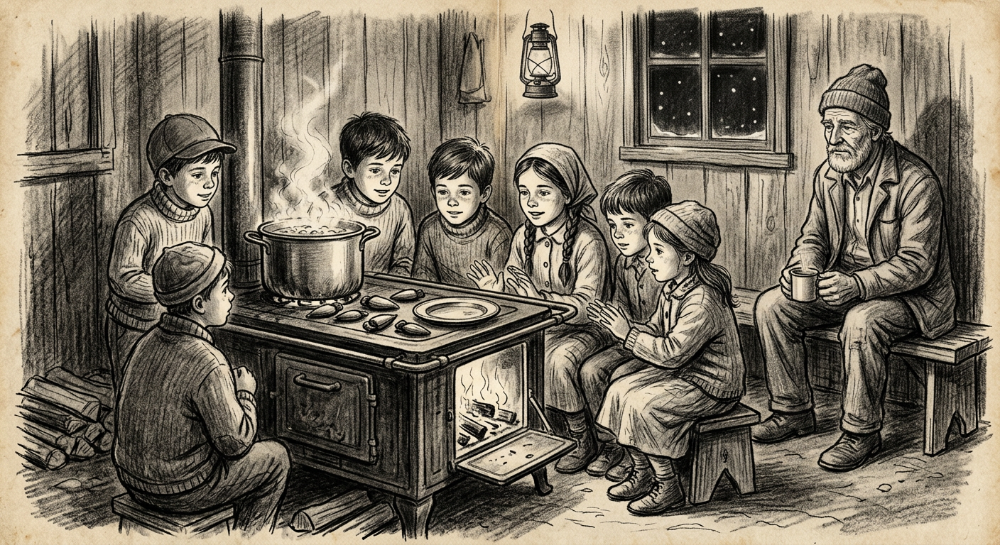
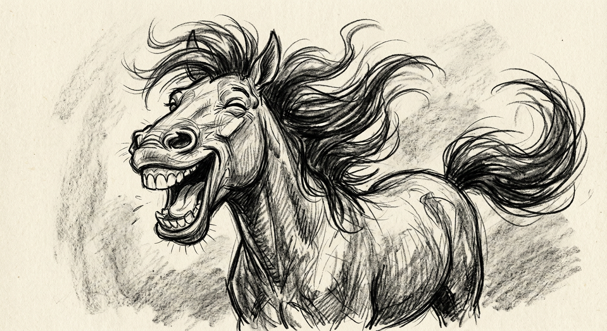

Talvez fosse o ano de 1958. Já fazia um tempo que morávamos ali onde papai se estabelecera com a bodega. Fieiras de bois arrastando madeiras. Caminhões com reboque e homens puxando catracas. Apitos de serrarias. Para onde ia tanta madeira? — São Paulo, Brasília, uma cidade que se expandia e outra que nascia.

Verdade é que essa epopeia nada tem a ver com o cavalo "Javali", embora emblemático. O novo cotidiano era quase o mesmo do Rio Grande do Sul.

Logo após o anoitecer e do jantar, ficávamos nos aquecendo em torno do fogão, enquanto batatas eram cozidas para o café da manhã. Isso durava mais ou menos quarenta minutos, por vezes uma hora, em conformidade com o tamanho das batatas. Havia batatas enormes, ou pra lá de grandes. A lavareda alimentada com nó-de-pinho avermelhava a chapa.

Ficávamos todos ali na vigília tagarelando sobre os frequentadores da bodega. Mais das vezes só para um trago. Outros vinham para comprar do básico: farinha, açúcar, erva, ferramentas; por vezes senhoras e moças em busca de panos brins, chitas, pelúcia e adereços. Não raro apareciam uns piás apressados e estrafegados em busca de cibalenas, xaropes, elixires etc. Lembro de alguns: Emiliano, Gumercindo, Veio Bento, Theodorão, Pedrinho Fação. A lista seria enorme, porém no momento não interessa — porque o causo é outro.

Conforme disse e reitero *"hic et nunc"*: estávamos ali ao redor do fogão, e justamente naquele dia assávamos pinhões na chapa enquanto as batatas ferviam expremidinhas na panela, quando alguém comentou do "Cavalo Javali". Um cavalo que papai possuía no Rio Grande do Sul — na verdade um matungo. O cavalo talvez seja a lembrança mais marcante dos meus tempos de guri.

Queria saber por que papai havia vendido o cavalo. Papai que assuntava as prosas enquanto enrolava "o pito", pigarreou e passou a dar as devidas explicações:

— Certo, eu vendi o cavalo. Era um cavalo bom, mas tive que vendê-lo quando resolvi mudar para o Paraná. Meu plano era ter uma pareia de burros, apareceu uma oportunidade e "briqiei". Esse burro que está aí — o Macaco. O outro, o Mico, eu comprei aqui no Paraná e daí formei a pareia. São dois burros muito bons. Com essa pareia vou pra todo o lado, busco sortimentos para a bodega, de vez em quando carrego noivos, padrinhos para batizados e até defunto para o cemitério. Se for preciso vou à Pato Branco ou no Marrecas. Essa pareia de burros é de grande serventia, é um capital. O "Javali" era um cavalo bom, manso, mas já meio velho. Fiz um bom negócio — aliás, como já tinha feito as outras vezes.

— Que outras vezes? — perguntou um dos piás, mais interessado no assunto.

— Bem, é que aquele cavalo já tinha sido meu quando eu ainda era solteiro. Tinha vinte anos e arrendei uma terra para fazer uma roça pra mim e plantei trigo. Semeei junto, mas já meio "tarde" — já tinha passado a crescente da lua certa. Mesmo assim aquele trigo cresceu que foi um espetáculo. Era mais ou menos três quartas de terra, quase beirando um alqueire, e rendeu mais de cem sacas. Na verdade, cento e três sacas e uma quarta... Olha, se tivesse prêmio eu teria tirado o primeiro lugar. Nunca vi coisa igual.

O piá mais velho questionou:

— Mas, cento e três e uma quarta?

— Sim. Pra que eu iria mentir para vocês por conta de quinze quilos?... A gente sempre tem que falar a verdade.

E continuou:

— Vendi a produção por um preço muito bom. Pensei: "Tô rico!" Como eu era solteiro, só pensei numa coisa: comprar um cavalo e um revólver. O revólver foi até fácil — um 38, cano longo, niquelado, coisa de estancieiro. Já o cavalo foi mais complicado. Quem tinha cavalo bom não vendia. Fui pra lá e pra cá, especula daqui e dali, tenteando, até que encontrei um. Não era cavalo novo, mas ainda muito esperto e aguentava o tranco. Era até marchador. Comprei, montei e saí a galopito, sem mesmo perguntar qual era o nome do cavalo. Acontece que cavalo tem que ter nome. Observando bem o pelo do animal — meio tordilho, nem preto nem vermelho, quase acinzentado — comparei com o pelo de um porco do mato e dei o nome de "Javali". E assim ficou.

Muito pachola, vez e outra dava umas volteadas pela redondeza, e numa dessas arrumei uma namorada. Não vou dizer que era bonita, mas era. Um sábado, como de costume, me bandei pra casa dela. Cheguei no entardecer. O pai da moça me recebeu muito bem e mandou soltar o cavalo no piquete.

Naquilo chegavam da roça os irmãos da moça, dois rapazotes muito trelas, e conforme foram chegando anunciaram:

— Olha o tamanho da abóbora que achamos!

Se bem que eles falaram em italiano desse jeito: *"guarda la zucca che abbiamo trovato"*. — *"Cozi si parla in italiano, magari, no parlo molto bene, perche fa tempo che no parlo con nessuno."* — Porca miséria.

De fato, era uma baita de uma abóbora. Um deles disse: vamos pesar. Vieram com uma balancinha que alcançava só vinte quilos e daí não teve jeito — tivemos que cortar a abóbora em três pedaços. Somamos e deu trinta e seis quilos e quatrocentas gramas. Coisa de se admirar. A noite chegou, todos se recolheram, ficando a abóbora ao relento sem que alguém se desse conta que o cavalo estava solto por ali. Depois do jantar e algumas prosas, todos foram dormir.

Mal clareando o dia, acordei com o trololó dos rapazes. Pulei da cama e, chegando pra perto, perguntei do acontecido, ao que um deles falou:

— A abóbora, cadê? A abóbora sumiu!

Olhei pra todas as bandas e, meio ressabiado, falei:

— Na madrugada escutei o "grute-grute", imaginei que o cavalo estivesse comendo um pedaço de abóbora, mas que tenha comido toda, acho que não.

Ficou o mistério. Quem mais poderia ter comido aquela abóbora se ali só estava o "Javali"?...

Sucedeu que aquele namoro não deu certo. Passou um tempo e arrumei por namorada a mãe de vocês. Resolvemos casar e tive que vender o revólver e o cavalo para comprar as coisas mais necessárias. Comprei uma vaca, uma porca, dois terneiros, os quais depois fui amansando — e deu uma boa junta. Só anos mais tarde é que comprei uma carroça, essa que está aí. Antes eu pegava emprestado do vizinho que tinha duas.

Enquanto o causo não terminava, "tava nóis" ali revirando os pinhões na chapa, descascando um e outro e atiçando o fogo pra aumentar a fervura da panela. Alguém ainda querendo saber da verdadeira história do cavalo "Javali" perguntou:

— Mas e daí... o Javali não tinha sido vendido?

— Sim tinha. Mas, depois de uns dois anos de casado, boas colheitas e já ter engordado alguns leitões — na verdade oito porcos de oitenta quilos, fora um que reservei pra carnear e fazer banha, salame, carne na lata pro gasto —, me sobrou um dinheiro e então resolvi comprar um cavalo. Até mesmo porque fazia uma falta danada. Mas, como eu ia dizendo: cavalo bom só por um bom dinheiro. Campeei, procurei, até que um amigo me informou: "O fulano lá da Coxilha Seca tem um cavalo pra vender." Fui lá — por sinal pedi emprestado o cavalo do vizinho, porque era meio "lonjote".

Lá chegando, o dito fulano me apresentou o cavalo. Olhei bem e falei:

— Conheço esse cavalo. Ele já foi meu; por sinal o nome dele é "Javali".

O sujeito me olhou meio ressabiado, talvez pensando que eu não quisesse o negócio, e continuou gabando o cavalo:

— Está para venda, mas eu quero três contos de réis.

Rodei. Ranhei e arranhei:

— O cavalo já tá meio velho. Se quiser dois contos eu lhe dou.

O homem renegou, sapateou, mas depois de uma boa pechincha fechamos negócio por dois e trezentos. Levei pra casa no cabresto. Cavalo manso de verdade. A mãe de vocês montava com nenê no colo. E você — apontando para o guri mais velho — com oito anos ia no moinho com mais de sessenta quilos de "moagem".

Aconteceu que um dia, quando eu voltava da roça, já tardinha com a carroça puxada pelos boizinhos, vi que havia muitas abóboras graúdas e maduras espalhadas na resteva do milho. Resolvi colher algumas. Junta aqui e ali, e quando me dei conta a carroça estava cheia. Sei lá — talvez uns duzentos, trezentos quilos. Eram mais de vinte, todas acima de dez quilos. Cheguei em casa, tirei os bois da canga e deixei as abóboras na carroça. Já estava escuro, começo do mês de junho. Estava frio e fui pra dentro de casa. Até pensei: o cavalo tá solto — no entanto, se comer uma abóbora não tem problema. Abóbora era o que mais a gente tinha. Jantamos e dormimos. No outro dia cedo, olhei para a carroça: nem uma abóbora dentro.

Nessa, o mano mais velho não se aguentou:

— E o pai acha que o "Javali" comeu aquele tanto de abóbora?

Bem — disse ele, novamente pigarreando. — Aqueles trinta e seis quilos e quatrocentas gramas que nós pesamos, não tenho certeza. Mas os duzentos que estavam na carroça, eu garanto!

Ainda há pouco ele havia dito que não se deve faltar com a verdade. Não nos restou outra alternativa senão aceitar.

---

O tempo passou e eu vez que outra lembrava do "Javali". De uma feita, cerca de quarenta anos depois, em Rondônia, numa roda de amigos numa festa junina, sentados à beira da fogueira, todos jogando conversa fora, contei a história do "Cavalo Javali".

Face ao princípio de que tudo é verdadeiro até prova em contrário, o causo foi levado na mais alta consideração — exceto por alguns "miserentos" que fizeram comentários graciosos, somente admissíveis em festividades juninas.

Na ocasião ali se encontrava um vivente já passado dos setenta: gaudério esfolado de alça de gaita, nascido nos campos de Soledade, criado na costa do rio Uruguai, não longe da referida Coxilha Seca, que depois se alongara para o Paraná e visitava parentes em terras rondonianas. Atentamente ouvia o causo. Sujeito de boa prosa, caborteiro, ajeitou-se no cepo em que estava sentado e entrou firme na conversa:

— Eu conheci o "Cavalo Javali"! Inclusive, de uma certa feita, numa "carreirada" lá para as bandas de Coxilha Seca, deu entrevero por causa desse cavalo...

Nesse momento, um gaiato jogou um petardo na fogueira e foi aquele esparramo. Cinza e fumaça pra todo o lado — e o povo se arredou.

Diante dessa barbaridade, termino o causo, lamentando que aquele respeitável e honrado senhor foi cerceado no seu legítimo direito de dar testemunho de outras proezas daquele afamado tordilho também conhecido por "Cavalo Javali".

---

**UPA CAVALINHO**

*Upa, upa Cavalinho,*\
*Galopando pela estrada.*\
*Upa, upa cavalinho;*\
*Noite escura, madrugada.*\
*Upa, upa cavalinho,*\
*De volta pra minha casa,*\
*Foi só um burburinho;*\
*Água na beira da estrada.*

*Upa, upa cavalinho;*\
*Sobe morro desce serra.*\
*Muitas flores no caminho,*\
*Suave brisa da primavera.*\
*Upa, upa cavalinho;*\
*Do jeitinho que eu quiz.*\
*Tem cabelo enroladinho.*\
*Olhos verdes, boca e nariz.*
