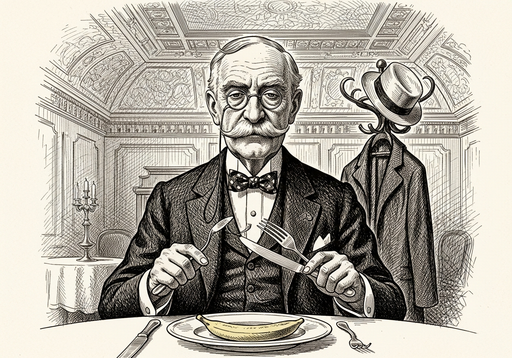
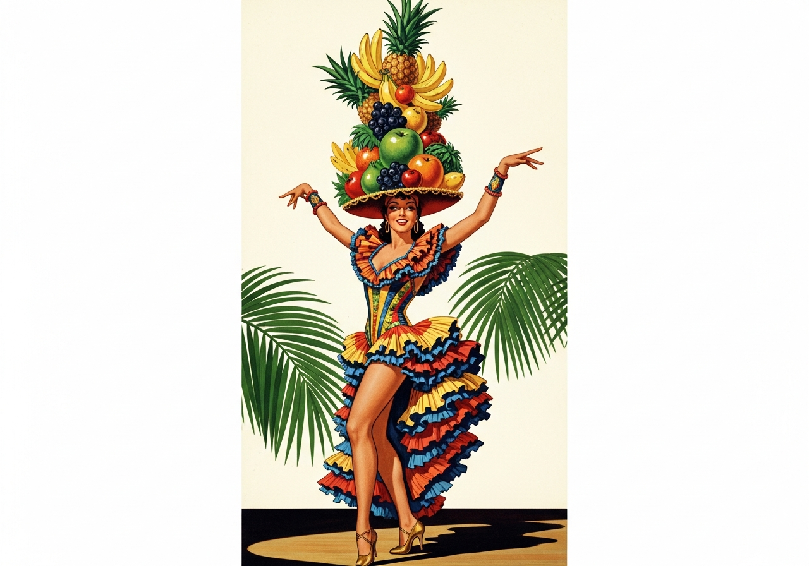

Sofisticada fruteira posta sobre a mesa e enfeitada com um belo arranjo de gerânio de matizes diversas. Com dáctilos arqueados, como se fossem garras aquilinas, firmemente retirou daquela fruteira um espécime paradisíaco que aguçava suas glândulas degustativas. Acomodou-a leitosamente no prato de fina porcelana posto à sua frente, ladeado por magníficos talheres de prata.

Seus lábios, encimados por volumoso e grisalho bigode, abrigado sob adunco nariz, sustentáculo de um par de óculos estilo vitoriano, e atalhado por sobrancelhas "lobatianas", denunciaram um discreto sorriso. Descontraiu a grande testa enrugada e exalou um profundo e longo suspiro como que tomado por grande alívio.

Empunhando os finos talheres — garfo na mão esquerda e faca na direita —, cortou as extremidades, em seguida traçou um corte longitudinal dividindo a fruta em duas partes simetricamente iguais. Singelamente subdividiu em nacos e um a um lentamente passou a degustá-los.

Concluído o lauto banquete, acostou-se na cadeira e disfarçadamente levou a mão à boca para ocultar a eructação.

Satisfeito, contemplou o teto e as sanças ornadas de arabescos dourados, para logo em seguida baixar o olhar sobre as cascas daquela fruta pertencente à família das musáceas.

Ato contínuo, pôs-se em pé, apanhou seu chapéu panamá pendurado no cabideiro do hall de entrada, cordialmente acenou para o garçom que visivelmente aguardava por uma gorjeta.

Pisando o patamar revestido de mármore, ganhou a calçada de paralelepípedos de rocha magmática. Com passos firmes deu início à sua caminhada, em clara e inequívoca demonstração de que todo indivíduo tem direito de comer o que bem lhe prover, independentemente das circunstâncias.

---

Por oportuno, vale salientar que a banana não é uma espécie nativa. E quando alguém diz que uma mulher é uma musa, poderá estar fazendo alusão à *Musa ornata* — ou seja, uma bananeira, espécie asiática e invasora da mata atlântica.

Para quem não sabe ou nunca ouviu falar, Carmem Miranda gravou e fez sucesso nos *States*. Em inglês. Yes.

> *Eu sou Chiquita Banana e vim para dizer*
> *Bananas têm que amadurecer de uma determinada maneira*
> *Quando elas estão pintadas de marrom e têm uma cor dourada*
> *Bananas têm o sabor melhor e são melhores para você*
> *Você pode colocá-las em uma salada*
> *Você pode colocá-las em uma torta*
> *De qualquer maneira que você pode comê-las*
