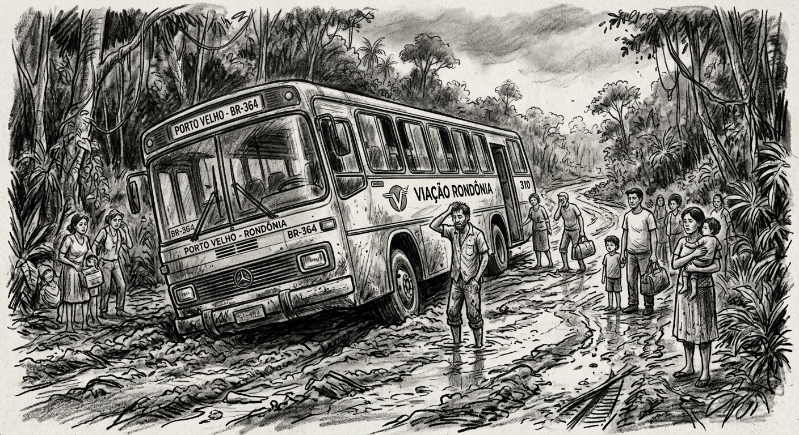

Foi em 09 de março de 1500 que Pedro Álvares Cabral partiu de Lisboa, rumo às Índias, e no meio do caminho — sem querer querendo — descobriu o Brasil, que na verdade já estava descoberto.

Muito tempo depois, em 09 de março de 1981, parti de Curitiba, rumo a Rondônia, aqui chegando somente no dia 22. Conclusão: de Lisboa ao Brasil de caravela, foram necessários 40 dias, ao passo que de Curitiba a Rondônia, de busão, apenas 12. Cabral teve que se desviar das calmarias na costa africana e eu, para chegar em Rondônia, tive que me desviar dos atoleiros da BR 364.

Os atoleiros da BR 364 e outras estradas que rasgaram a floresta amazônica — notadamente Rondônia e Mato Grosso — são um capítulo à parte da epopeia da conquista do Norte do Brasil, abaixo do Rio Amazonas.

Cabral permaneceu alguns dias em Porto Seguro. Fazendo o quê, não sei. Certo é que descobriu muitas índias — e os portugas queriam ficar por ali para fazer umas selfies na praia.

Conforme relatou Caminha: *"Ali andavam entre eles três ou quatro moças, bem novinhas e gentis, com cabelos muito pretos e compridos pelas costas; e suas vergonhas, tão altas e tão cerradinhas e tão limpas das cabeleiras que, de as nós muito bem olharmos, não se envergonhavam."*

A grande descoberta de Cabral foi que os índios não queriam nada — além de espelhos e bugigangas. O resto eles já tinham. Era sombra e água fresca.

A folga acabou quando Frei Henrique de Coimbra reclamou: — Pois, pois, e que estou eu a fazer aqui? Cabral, que era soldado de Cristo, entendeu que era hora de postar a carta comunicando ao Rei o achado. Para isso designou o erudito Pero Vaz de Caminha — e seguiu seu destino.

Dizem que o Rei D. Manuel não gostou da parte da carta que dizia *"AQUI SE PLANTANDO TUDO DÁ"*. Tanto é que pouco se interessou pelas terras descobertas. Ele queria saber de ouro e prata, petróleo e terras raras. Daí já viu — todo mundo passava por aqui para tirar uma casquinha, e até hoje continua do mesmo jeito. Até o amigo Trump mandou às favas a lei Magnitski quando viu que o Xandão era mais útil para ele do que um bando de patriotas.

De resto, tudo foi a trancos e barrancos e o Brasil foi povoado em todo o litoral — e aos poucos conheceram o interior, através dos rios: Amazonas, São Francisco, Paraguai e Tietê.

A ocupação do Centro-Oeste só avançou quando o Presidente Juscelino resolveu construir Brasília. A Amazônia permaneceu quase intacta, apenas com algumas cidades ribeirinhas como Belém, Manaus, Rio Branco e Cuiabá.

Foi uma explosão a Conquista do Oeste. O cerrado e a mata amazônica foram ocupados de repente — de 1957 a 1987. A diferença é que quem foi para essas plagas não foi para fazer turismo e tampouco para salvar as girafas. Milhares se embrenharam pelo cerrado e pela floresta e, em 30 anos, transformaram uma região inóspita em solo produtivo: grandes rebanhos bovinos e a maior produtora de soja e outros grãos que sustenta o mundo.

Registrou Pero Vaz de Caminha: *"Águas são infindas e em tal maneira é graciosa que, querendo-a aproveitar, dar-se-á nela tudo, por bem das águas que tem."*

---

Está faltando registrar o que disse Frei Henrique de Coimbra ao fidalgo Pedro Álvares Cabral: — Pois, pois, o que estamos a fazer aqui? *Ti manca, Cabral.*

Cabral se mandou para o Oriente — para nunca esquecer as belas Índias.

Assim foi que escolheram um escriba para informar o Rei. Um tripulante conhecido por Pero Vaz de Caminha escreveu uma carta no mais rebuscado português, o que tomou três dias do rei para interpretá-la. Dom Manuel mandou guardar a carta bem guardada — afinal, era a certidão de nascimento de uma futura nação que, depois de muitas pendengas, veio se chamar Brasil.

O nome Brasil guarda muitos mistérios. Pois segundo dizem, no tempo do Rei Salomão, um povo conhecido por Fenícios por aqui esteve, e teria dado esse nome — cujo significado pode ser qualquer coisa referente ao Pau Brasil, que com certeza foi utilizado na construção do Templo do Rei Salomão. Não vou falar sobre isso, pois poderão dizer que é "fake news".

Desde então, esse tal Brasil tem servido de pano de fundo para muitos fatos e feitos. Tem terras férteis, água em abundância e florestas incomparáveis. De outro lado, governantes corruptos e um povo que "Deus me livre" — cujo maior sonho é ser governante.

Aqui é o paraíso. Muitas praias e alguns morros para justificar a presença dos narcotraficantes. Florestas, pântanos e cerrados para justificar a ação dos ecologistas e em particular a COP 30. Muitas igrejas, farmácias e garagens de automóveis para justificar a lavagem de dinheiro. Samba e futebol para justificar a alegria do povo.

Alguém disse nas redes sociais: *"A COP 30 escancarou o abismo entre o discurso de sustentabilidade e a prática do governo. Enquanto vendem o discurso de sustentabilidade, a realidade em Belém é de desorganização e desperdício de dinheiro público."*

Só que dessa vez os gringos não deram muita bola para a tal COP 30. Do jeitinho que fez o Rei D. Manuel: floresta, que nada. Queremos dólar, petróleo e outras "coisinhas mais".

O mundo começou a descobrir o Brasil. Sabendo que aqui em se plantando tudo dá, já não querem conhecer borboletas, tirar dúvida sobre nascentes de rios, tirar retrato ou fazer selfies. Querem comida. E índio quer dólar.

Esse é o Brasil que se descobriu — que em se plantando tudo dá. Dá até cadeia para quem pinta uma estátua com batom ou ora na frente do Palácio do Planalto.

A grande descoberta é que no Brasil não tem governo — apenas um Executivo subserviente, um Legislativo corrupto e um Judiciário desvirtuado.

Ah, se Caminha tivesse relatado essas coisas para o Rei D. Manuel. Certamente mandaria Cabral cobrir novamente — para não passar para a história como a nação mais corrupta de todas as nações.

