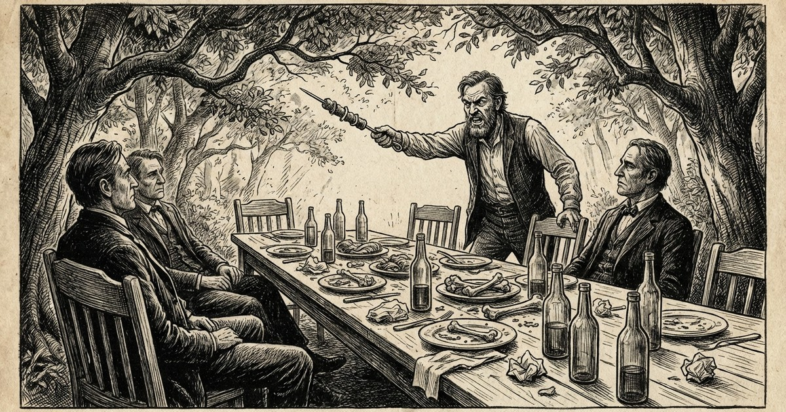

Eu não vi. Sei por ouvir dizer.

Era 27 de janeiro — creio que 1966. O casório foi marcado para essa data. Noivos e padrinhos vestidos no melhor estilo. Convidados da noiva, do noivo e outros que por força de circunstâncias não poderiam ser olvidados em evento tão importante.

O pai do noivo providenciou um grande banquete. A melhor novilha, bolos e cucas. Na sobra do arvoredo, uma grande mesa de tábuas construída sobre cavaletes, forrada de papel jornal e bem posta com pratos, talheres e copos. Logo ali uma vala com braseiro de nó-de-pinho, espetos de camboatá e a carne na gamela temperada na salmoura. Na outra banda um balcãozinho com um barril de vinho e muitas garrafas de framboesa refrescadas em um caixote com gelo e coberto de serragem.

A comitiva dos noivos chegou e foi recepcionada por uma saraivada de fogos de artifício. O céu azul ficou levemente enfumaçado enquanto que os cavalos arreados e amarrados nos pés de guabiroveira bufavam espantados, e os cachorros que rodeavam os espetos prontos para serem estendidos sobre o braseiro fugiram aturdidos pelos pipocos. No portal feito com folhas de palmeiras e flores de bem-me-quer, os convidados fizeram calorosa recepção com o tradicional:

— Viva os noivos! Viva os pais dos noivos! Viva os padrinhos dos noivos!

O pai do noivo, anfitrião, sempre atento para que tudo ocorresse dentro dos conformes. Todos os convidados foram acomodados na mesa. Na cabeceira os noivos, ladeados pelos padrinhos, e em seguida os pais dos noivos e por fim os convidados — afora as moças e rapazes que conversavam na sombra das árvores e a gurizada que corria para todos os lados em grande alegria.

O pai do noivo sabia que entre os convidados havia aqueles que guardavam rancores entre si por picuinhas da vida — todavia acreditou que, em se tratando de uma festa familiar, não haveria quebra do decoro.

## O Banquete

O banquete foi servido. Os churrasqueiros, empunhando os espetos e facas, ofereciam bons assados de galinha, porco, cabrito e gado. Senhoras com aventais bordados levavam tigelas com macarrão e saladas, enquanto outras serviam vinho e refrigerantes.

Quebrados os paradigmas, causos e anedotas eram contados entre os convivas, além de comentários sobre acontecidos na redondeza.

Sempre atento, o anfitrião de nada descuidava — inclusive dos convidados que supostamente guardavam seus rancores.

Conforme dizem as escrituras, *"o vinho alegra o coração do homem"* — e libera as inibições. Estando tudo a contento, era justo que o anfitrião também participasse dos festejos. Conforme os costumes da época, a cantoria teve início. Sempre há quem canta, quem aprecia e quem não dá a mínima e permanece com seus pensares.

## A Paciência de Jó

Quando tudo já perfeito, eis que numa banda surge um burburinho — justamente entre eles, "os rancorosos".

Vai o anfitrião, serena os ânimos, e tudo volta ao normal, seguindo a festa.

Não demorou e novamente um disque-que-me-disse — e lá vai o anfitrião com a paciência de Jó e acomoda as cousas:

— Hoje é festa. É dia de alegria. Estamos entre amigos.
