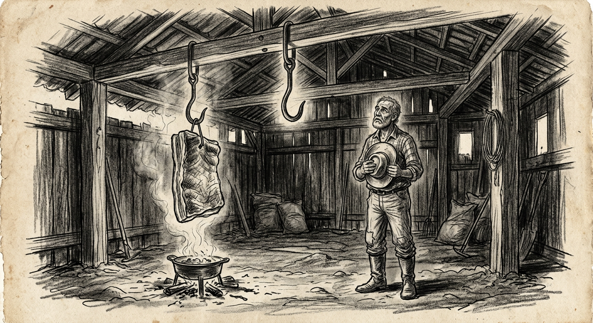

Falarei de uma antiga brincadeira de roda.

*"Cadê o toucinho daqui?*\
*— O gato comeu.*\
*— Cadê o gato?*\
*— Foi pro mato.*\
*— Cadê o mato?*\
*— O fogo queimou.*\
*— Cadê o fogo?*\
*— A água apagou.*\
*— Cadê a água?*\
*— O boi bebeu.*\
*— Cadê o boi?*\
*— Foi buscar milho.*\
*— Cadê o milho?*\
*— O padre levou.*\
*— Cadê o padre?*\
*— Foi rezar missa.*\
*— Então vou procurar.*\
*— Foi por aqui, foi por ali e por ali passou."*

Todos correm à busca de um esconderijo e o líder escolhido vai procurar. Após a algazarra e os comentários de como cada um conseguiu se esconder, tudo recomeça.

No caso, o padre é o grande vilão — que leva o que a pessoa tem de primário para a sobrevivência. Passa-se a vida procurando o vilão. Por mais que se busque, o mesmo não é encontrado. Sabe-se apenas que está cumprindo seu mister em um lugar qualquer.

Sempre estamos à procura do vilão. Mesmo sendo encontrado, queda-se ao argumento que está afeito aos seus misteres.

Trazendo a brincadeira para a atualidade, o padre seria substituído pelo político. Não que sejam inúteis. Sempre nos trazem a mensagem do progresso, do desenvolvimento, do bem-estar e da felicidade.

Todos os épicos têm na essência o questionamento de uma necessidade, o questionamento de como ocorreu a falta, o esforço da reconquista, a identificação do vilão, o comportamento altruístico, o conformismo e a esperança.

Cadê o dinheiro daqui? O político levou. Foi procurado e encontrado, porém a brincadeira não valeu — porque o sujeito que se procurava não era aquele que foi encontrado. Foi por ali e ali passou.

A brincadeira entrou em desuso e perdeu a graça. Já não se brinca de esconde-esconde como antigamente.

---

As coisas mudaram muito, mas de uma coisa tenho certeza: sei que foi por ali, por aqui e por aqui passou.

Lembro vagamente que foi eleito um presidente que renunciou seis meses após tomar posse. Lembro de um plebiscito do sim e do não, e de um presidente que foi deposto pelos militares — que governaram o país por mais de vinte anos. Tenho presente que elegemos um presidente que prometeu acabar com a corrupção e foi cassado por ser corrupto. De um presidente que prometeu acabar com a inflação. E de um presidente que facilitou os grandes esquemas de corrupção, conhecido pelos escândalos do mensalão e do "petrolão". De uma presidenta que foi cassada e de um vice que assumiu e não renunciou. De um presidente que se elegeu no vácuo das oligarquias e não quis compartilhar as benesses.

E de um presidente que foi preso, "descondensado" e eleito sabe-se lá como.

Lembro de um Brasil que foi por ali, por aqui — e o boi lambeu. Que o gato comeu, que o padre levou.

Mas não ficou nisso. Demorou, mas o bicho pegou. Virou num "furdunço". Muitas coisas aconteceram em defesa do Estado Democrático e de Direito. Nunca se viu tanta "trapalhada". Essa parte deve merecer a atenção dos historiadores isentos e independentes. Nomes ficarão na história — e com triste memória.

Para coroar, ocorreu o assalto aos aposentados. Mais uma CPI que deu em nada. Isso pelo excesso de envolvidos. Gente da "pica grossa".

Na verdade, estou mais preocupado com a merreca de aposentadoria. Será que o gato comeu, ou o padre levou? Porque sumiu?

Dizem que o Lula está de olho nela. Coisa que duvido — ele gosta de coisas mais polpudas. Mas foi por ali e por ali sumiu.

Na verdade, o Lula não sabe de nada. Quem sabe é o Lulinha, a Janja e o Xandão. Se bem que tem outros tantos, impossível de nomear.

