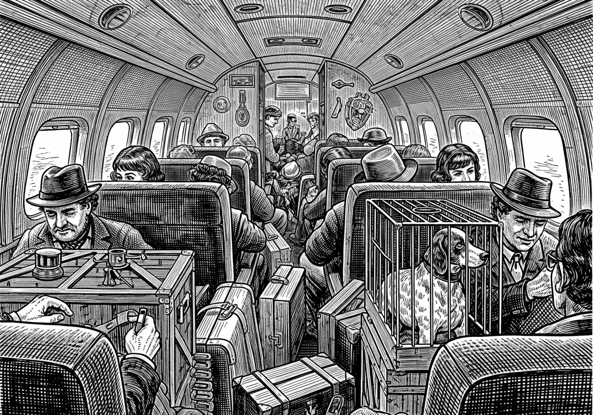
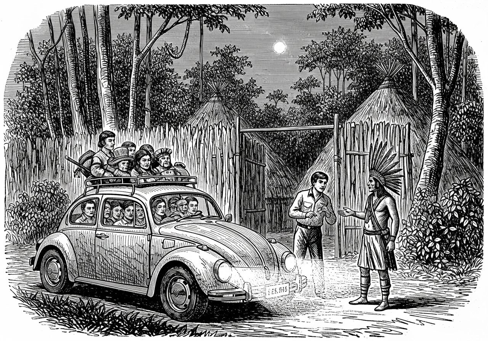
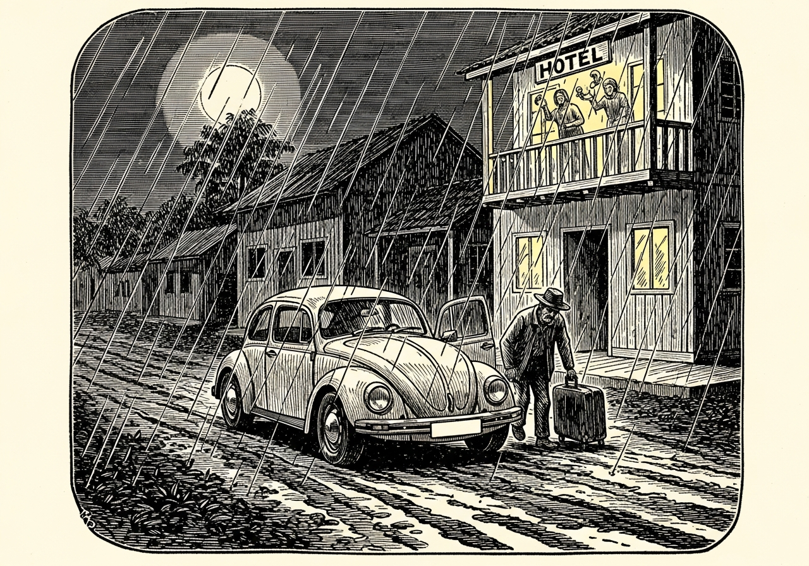
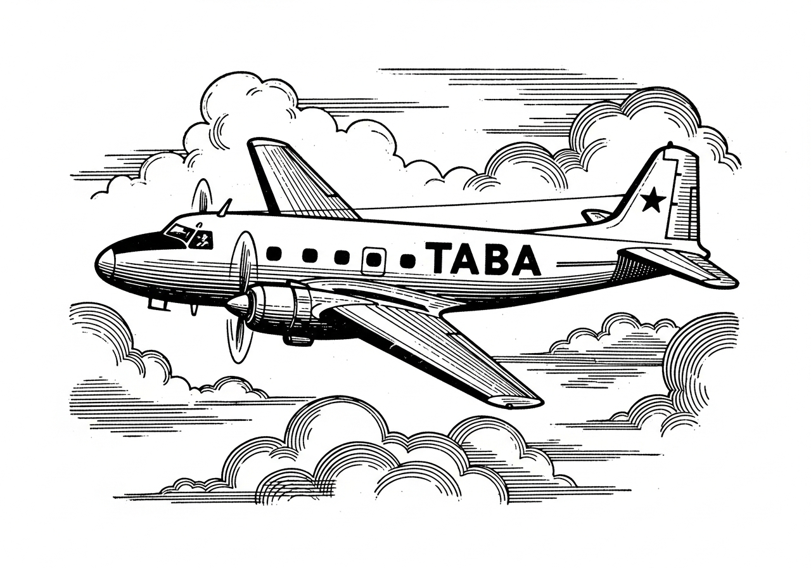

Ao contrário do [Cabeza de Vaca](/blog/cabeza-de-vaca/), fui do Sul pro Norte. Com 31 anos, era hora de buscar outro rumo. Por uma referência aleatória, me bandei para Rondônia. A Amazônia estava sendo ocupada, no cumprimento do objetivo do governo: "Integrar para não Entregar". O destino era Cacoal, cidade que surgiu na margem da BR 364, na década de 70. Até então, Rondônia era uma densa floresta cortada por uma estrada aberta por Juscelino Kubitschek, mais precisamente de Cuiabá a Porto Velho. O traçado já fora feito pelo Marechal Cândido Rondon em 1910, quando construiu a linha telegráfica Cuiabá-Porto Velho.

Em março de 1981, parti de Curitiba com uma mala e uns pacotes. De um só lance, a Viação Andorinha partindo de Maringá atravessou o cerrado mato-grossense. Uma viagem um tanto monótona. Por vezes a paisagem era quebrada pela presença de seriemas, casebres, barracas de lona e tratores que já começavam a rasgar o cerrado. Foram 24 horas de viagem até Cuiabá. Era praticamente o início da viagem; seriam mais mil quilômetros por uma estrada inimaginavelmente precária. Em 1972, o Governo Federal criou o projeto de colonização do Território Federal de Rondônia. Migrantes de todas as partes do Brasil passaram a ocupar a banda oriental da Amazônia.

> "O POLONOROESTE tinha como principal finalidade o atendimento à região do entorno da rodovia Cuiabá-Porto Velho (BR 364). Tal programa visava criar condições para a efetiva colonização da região, através da pavimentação da rodovia, como também pelo apoio aos projetos de colonização iniciados na década de 70."

O primeiro choque de realidade aconteceu ao descer do ônibus em Cuiabá. Na rodoviária, uma tabuleta informava o local de vendas de passagens para Cacoal. Aproximei-me do guichê para comprar a passagem. De pronto, o atendente informou que era necessário aguardar o retorno do ônibus que estava com um atraso de 15 dias. Foi uma ducha de água fria despejada em meu corpo suado, cansado e empoeirado. Era uma outra realidade. Tinha ônibus, mas, ao mesmo tempo, não tinha. Foi bom, dado que do contrário teria sucumbido no deserto verde e lamacento. Permaneci em Cuiabá por uma semana na casa de um amigo que se formara em medicina veterinária e havia migrado para lá.

Após conhecer algumas particularidades da região, consegui uma vaga no voo semanal da TABA (Transportes Aéreos da Bacia Amazônica). Uma aeronave do tempo da guerra — talvez tivesse cumprido missões jogando bombas sobre redutos nazistas ou transportando o brigadeiro Eduardo Gomes. Bimotor de dezesseis lugares, passageiros acomodados em assentos espremidos por malas, caixotes e bugigangas. Até uma gaiola com um filhote de cão de caça! O avião partiu às 14:30. Da janelinha dava para contemplar o infinito da floresta e, por vezes, sumíamos entre as nuvens encasteladas. Por volta das cinco da tarde, a nave aterrissou na cidade de Pimenta Bueno. A pista era um lamaçal ladeado pela floresta. Restavam 50 quilômetros para o destino final.

Ali mesmo, na pista, apareceram táxis. Lotamos um fusca e partimos. O taxista alertou: "Tem um atoleiro ali no Riozinho. Vai ser noite e, para seguir, tenho que pedir autorização do Cacique da tribo para passar por dentro da aldeia. Se não deixar passar, teremos que voltar." Parece que naquele dia o cacique estava de bom humor ou o pedágio havia sido pago com antecedência. Via de regra, um litro da boa.

Não demorou e chegamos ao destino sob uma forte chuva. O táxi parou na porta do único hotel da cidade, o "Hotel Decolares". Janta, pernoite e café da manhã. Era dia 22 de março de 1981. O bom da história é que o dinheiro acabou.

Clareou o dia e fui em busca da única referência que tinha daquele lugar: um paranaense nascido em Santa Catarina que havia migrado para Rondônia há alguns anos e era dono de serraria. Não foi difícil encontrá-lo. Recebeu-me muito bem, conforme os costumes. Forasteiro tem que ser tratado com o pisca de alerta. Em seguida, apresentou-me a um advogado paraibano. Às oito da manhã eu estava acomodado em seu escritório. Estava tudo certo. Ali era o fim da picada. Só faltava dinheiro para comer e lugar para dormir.

*(Continua...)*

