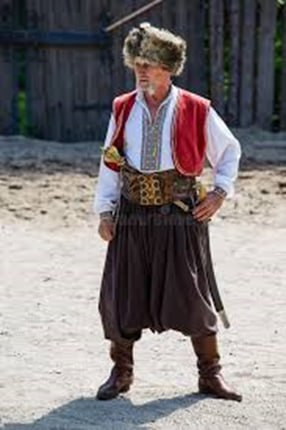

Do meu jeito de contar.

Segundo dizem, e numa dedução linguística, ucrânia é um sinônimo ou derivado de fronteira. Assim como os gaúchos se diziam da fronteira, porque separavam os invasores portugueses dos invasores espanhóis na América do Sul, os ucranianos ficam na fronteira entre os povos eslavos e europeus, itálicos, germânicos etc.

Até aqui e talvez, somente isso é o que há em comum entre os gaúchos e os ucranianos, afora a bombacha, as botas, o pala e demais adereços utilizados pelas prendas sempre mui enfeitadas.

Tudo começou lá pelos idos do ano 400, quando uns gaudérios — sujeitos alegres — vindos mais do Norte, se acamparam à beira de um rio, em uma colina coberta de neve e por ali ficaram até que se formou um vilarejo e deram o nome de KIEV em homenagem ao chefe da tribo. Só mais tarde é que criaram o CTU. (Centro de Tradições Ucranianas.)

Um tempão depois disso, lá pelo século IX, os VIKINGS, uns caras metidos à besta, que queriam ser donos do mundo, passaram por ali, e foi que sucedeu o maior entrevero. — Entrevero significa "meia verdade". — O causo não ficou bem contado, mas os ditos invasores saíram na base do empurrão e no bico da bota. Pra comemorar o feito, os ucranianos fizeram uma baita bailanta. Por conta disso, que os gaúchos se inspiraram para celebrar a Semana Farroupilha. Uma semana de festa.

Quando já bem tragueados pela VODKA, os ucranianos realizavam um campeonato de dança denominado de KAULA, uma dança só pra macho, por riba de uma lança de três metros. E pra variar faziam a dança dos facões. Era de sair faísca. Também faziam a dança conhecida por CHULA. No fundo trata-se de um exercício para testar o equilíbrio.

Alerto que quem quiser saber mais sobre os migrantes ucranianos e outros que vá pesquisar. Ou como dizia o falecido vovô Franquelim: "Vá te afumentá." Traduzindo: Acenda o palheiro e fique jogando fumaça pro vento. Na verdade, o que descrevo aqui não é nada. A Ucrânia tem uma história milenar e de grandes feitos.

Tudo ia bem entre os ucranianos, lá no velho mundo, até o ano de 1300, quando um bando de fuzarkeiros, de olhos puxados, montados em cavalos, por lá chegaram e fizeram o maior esparramo. Ainda bem que não durou muito tempo. O chefe deles, conhecido por Genginskham, era chegado numa bebida conhecida por Varenukha, produzida pelos ucranianos, e acabou morrendo de bêbado — ou seja, na maior manguaça.

Acontece que tudo o que é bom dura pouco e lá pelas tantas, ou mais ou menos pelos idos de 1750, uma tirana — Catarina a Grande —, e segundo os ucranianos, "grande sem vergonha", invadiu o país e proibiu até o idioma ucraniano. Não carece dizer que ela era russa. E põe russa nisso.

O pior mesmo aconteceu por volta de 1917, quando surgiu um movimento político liderado por três cabras safados: Trótski, Lenin e Stalin. Esses três eram amigos, mas não amarravam as éguas no mesmo pau. Com suas ideologias, provocaram a maior desgraceira não só na Ucrânia como pelo resto do mundo. Isso pra não dizer genocídio — que envergonha a história da humanidade —, conhecido por **Holodomor** (DEIXAR MORRER DE FOME).

Pra não espichar o causo, que já está mais cumprido que "chimarrão de polaco", a partir de 1890, os ucranianos começaram a vir pro Brasil.

Vieram de bota e bombacha, faca e guaiaca. E o gaúcho gostou.

Quando da chegada dos primeiros no sul do Brasil, a cultura gaúcha já estava se espalhando pelos interiores catarinenses e paranaenses, graças aos tropeiros e à ferrovia que interligava São Paulo, Curitiba e Porto Alegre. Por aí os ucranianos também foram se espalhando — inicialmente como serviçais, depois passaram às práticas agrícolas no cultivo de fumo, batata, exploração da erva-mate e outras culturas. Criaram várias cidades, como Papanduva em Santa Catarina, e Prudentópolis no Paraná, esta conhecida como a capital da Ucrânia no Brasil.

Quanto à cultura e tradições, os mesmos conservam suas festas típicas, porém o estilo musical dos gaúchos bateu na veia — inclusive os trajes, que de longe lembram suas tradições. Quanto ao chimarrão, dizem que o chimarrão gaúcho é o melhor que há, desde que seja de Papanduva.

Pra encerrar: a Ucrânia teve um breve período de independência entre 1917 e 1921, quando foi absorvida pela União Soviética. As atuais fronteiras foram fixadas apenas em 1954. Recuperou sua independência em 1991, com a desintegração da URSS.

Terras férteis e detentora de tecnologias. Em fevereiro de 2022, foi invadida pela Rússia.

A guerra continua até hoje.
