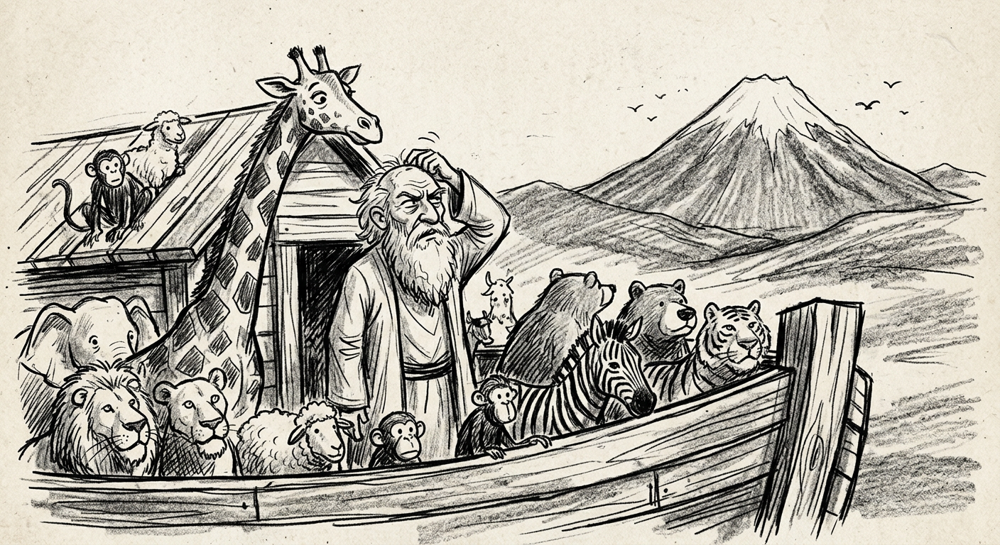
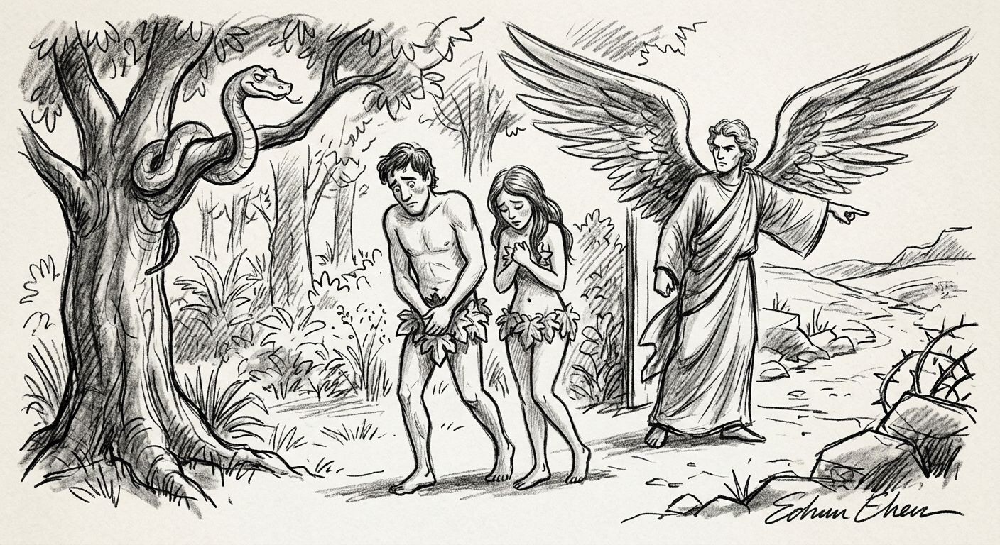
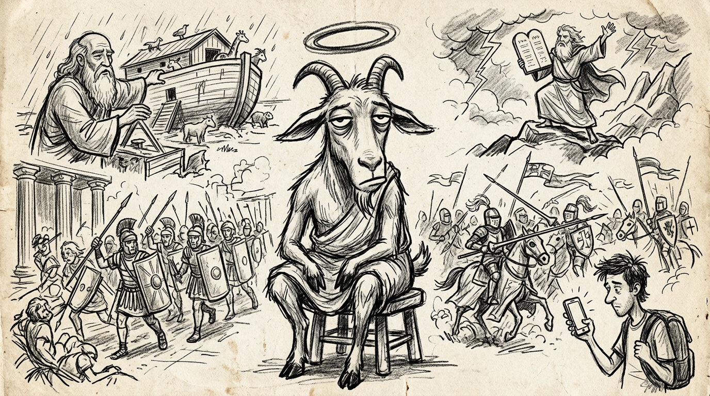
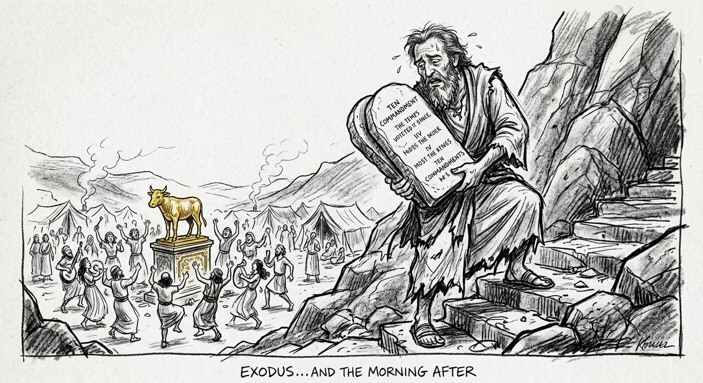
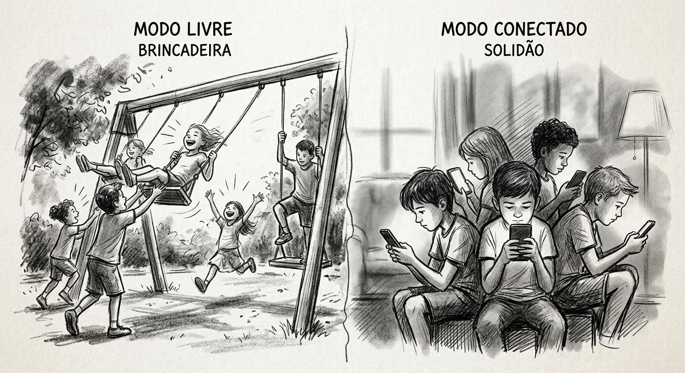

Aprendemos que a história é registrada a partir da descoberta da escrita e que os hieróglifos egípcios foram interpretados por Champollion em 1830. Segundo a arqueologia, tais escritos remontam a cinco mil anos. Coisa que duvido.

A história ocidental é contada a partir dos livros bíblicos, com muitas narrativas e lendas. É o caso do Dilúvio. A ciência comprova que em um dado momento houve uma grande inundação. Já os relatos sobre Noé e Gilgamesh podem ser classificados como lendas, até mesmo porque é inimaginável que alguém tenha construído um barco de madeira de dimensões de um Titanic, capaz de abrigar todas as espécies de animais.

Mesmo assim, necessário seria um grande conhecimento de engenharia. Lembrando que para a comemoração dos quinhentos anos do descobrimento do Brasil, a engenharia náutica brasileira não foi capaz de reproduzir uma simples caravela utilizada pelos portugueses nos idos de mil e quinhentos, nosso marco zero.

Tudo bem. Noé, após adquirir milhares de metros cúbicos de madeiras de boa qualidade — e não ter pago a ninguém —, construiu a fabulosa arca e quando chegaram as águas, flutuou e ficou à deriva até encalhar no Monte Ararat.

Só para lembrar, o referido monte tem mais de cinco mil metros. Se bem que não está escrito que a arca encalhou no topo da montanha. Pode ter sido na base. *"e a arca repousou, no sétimo mês, no dia dezessete do mês, sobre os montes de Ararate."* (Gn. 6.22). — Eles já tinham calendário.

Essa data deveria ser considerada feriado mundial. Sétimo mês deve ser setembro, no entanto no nosso calendário é o nono. Incrível nisso tudo é o dia. Só faltou a hora. Faltavam só três dias para o início da primavera. Pouco importa, porque no topo do monte é geleira o ano todo. Noé entrou numa fria. Desceu o morro batendo queixo.

Ninguém ainda encontrou a dita arca ou dela teve notícias. Se bem que tem uns arqueólogos afirmando que a encontraram. Tem até vestígios de cocô de grilo.

Como se sabe, os bichos se salvaram, bem como a tripulação. Abertas as comportas, todos saíram na mais perfeita ordem, desceram o morro e pouco a pouco repovoaram a terra.

No Brasil, D. João VI e a cambada que o acompanhava, quando veio de Portugal se borrando de medo de Napoleão Bonaparte, se acampou na beira da praia e o povo teve que subir o morro. Foi o marco zero das favelas.

## Adão e o paraíso

Antes disso, porém, e bem antes, Adão teve que sair às pressas do paraíso, tudo por causa de uma serpente encrenqueira. Foi o fim da moleza e o marco zero da luta pela sobrevivência.

Dizem que o paraíso se localizava entre dois rios. Particularmente acredito que o paraíso era à beira-mar, uma praia paradisíaca, onde havia muitas lagostas e logo na encosta um pomar maravilhoso. Somente quando foram expulsos daquele paraíso é que se deram conta que estavam com a bunda ao relento. Ficaram sem eira e nem beira. Literalmente tiveram que ir pra roça. Sabe-se que seus filhos eram agropecuaristas. Um dia as vaquinhas de um invadiram a lavoura do outro e o pau comeu. Importante ressaltar que ainda não existia arame farpado.

Em razão do assassinato, Caim teve que se mandar e se bandeou para a banda oriental e ficou campeirando de instância a instância, feito "cusco" sem dono. Teve muitos filhos, e, segundo dizem, Noé era seu descendente. Somos todos da mesma patota, inclusive os iranianos que vivem perturbando as ideias dos israelitas.

Passada a quarentena do dilúvio, os descendentes de Noé se espalharam pela região, começaram a fazer rabiscos nas pedras e, como já estava no sangue, se atracaram a plantar e criar animais, principalmente bodes, bovinos, jumentos e dromedários. Consta que colhiam uvas e delas fizeram um bom vinho e Noé tomou o maior pileque a ponto de perder os panos de bunda. Foi o marco zero da gandaia.

## Camelo e o transporte

Começaram a domesticar animais, só que sobrou mesmo pro coitado do camelo. Indivíduo desajeitado e resistente. Alguém teve a ideia de colocar algumas coisas na sua cacunda. Foi o marco zero dos transportes.

Tinham uns vadios sem vergonha que não queriam nada com nada e ficaram acampados na beira dos rios, ou na praia matando peixe à pau. Aconteceu que os peixes ficaram mais ariscos, aí os caras tiveram que se virar. Um dia o mais vadio de todos fez uma fina trança com os fios do rabo do jumento, amarrou num gancho qualquer e jogou na água. Não há de ver que pegou um peixe. Foi o marco zero da pesca esportiva.

Pensa numa diversão interessante. O tadinho do peixe que está lá no fundo, se esquivando de seus predadores naturais, de repente abocanha um troço que parecia inofensivo e babau. Na verdade, uma verdadeira sacanagem. Coisa de gente desocupada.

## A roda

Mas aquele negócio de transportar no lombo do camelo ou do jumento não era muito produtivo. Não demorou e inventaram a roda. Aí não teve pra ninguém. Ou melhor, a coisa melhorou pra todo o mundo. Ainda bem que a invenção não foi patenteada. Esse foi o marco zero da tecnologia.

Foi mais ou menos na mesma época que descobriram que das pedras podia ser tirado materiais mais resistentes que a própria pedra. Mesmo assim a roda permaneceu como tecnologia de ponta. Tão importante que servia de base de troca. Uma roda valia um boi ou alguns balaios de cereais. O nome original era "MÓ".

Muito tempo depois, os economistas — ou seja, aqueles que nada produzem, mas colocam preço nas coisas dos outros — deram um nome mais sofisticado e moderno e a MÓ passou a se chamar moeda. Para evitar confusão, a verdadeira MÓ passou a se chamar roda, ou aquilo que além de redondo gira. Com o tempo todo o mundo começou a fabricar rodas. Tinha roda de todo o tipo. De pau, pedra, ferro. O que valia mesmo era a roda de ouro.

## Torre de Babel

Nesse meio apareceu um bando de ignorantes que resolveu construir uma torre cujo topo fosse além das nuvens e alcançasse o céu. Foi o início do globalismo.

Quando a torre estava lá nas alturas houve um desentendimento geral. Alguns foram para a direita, outros na esquerda e outros ficaram no centro. Os do centro gritavam: "Daqui não saio e daqui ninguém me tira". E os demais se espalharam pelo mundo afora e aqui e acolá aprontavam confusões na busca de direitos e igualdade social.

Nesse ínterim alguém quis saber qual a verdadeira finalidade da torre. O Chefe não soube explicar direito e teria dito que era para se comunicar com os que estavam acima das nuvens. O povo que não era besta não aceitou a explicação, até mesmo porque não havia comprovação científica. Virou num angu de caroço. Ninguém mais sabia quem era quem, e as obras foram paralisadas. Foi o marco zero das obras inacabadas.

Somente no século XXI apareceu um doido que resolveu concluir algumas obras abandonadas, como por exemplo a canalização do Rio São Francisco. Mesmo assim teve quem reclamasse dizendo que tinha que esperar pela volta de quem começou, abandonou e estava preso. E não é de ver que voltou, mas daí é outra história.

Voltando à vaca fria — ou melhor dizendo, à torre inacabada —, evidentemente que com o tempo e péssima qualidade dos materiais tudo se deteriorou e ruiu.

## O chifre de bode

Esse negócio de obras é um problema, porque até muralha de pedra bem construída um dia ruiu só com o som das cornetas. Sim, cornetas feitas de chifre de bode.

Necessário ressaltar a importância do "chifre de bode". Possivelmente foi a matéria-prima para a construção do primeiro anzol. Chifre de bode tinha muitas utilidades. Servia como instrumento para cavar a terra, instrumento musical, sirene, caneca pra beber cerveja, porta-moedas e celular.

Aquele povo que derrubou as muralhas da cidade na base da corneteada para conquistar a sua terra era da esquerda e vivia invadindo terra dos outros. Contudo essa terra era desértica e ali e acolá havia lugar para plantar. De resto criavam cabras e jumentos. Mesmo assim ali permaneceram, porque era a terra prometida aos seus ancestrais.

Existia outro povo que morava numa região onde o capim era mais abundante e ao invés de bodes, criavam bois — e por consequência a concorrência foi brutal. Esse povo logo foi injustamente apelidado de cornudos. No entanto os criadores de bovinos parecem que não deram a mínima. O negócio era boi no pasto e moeda no banco.

Foi quando apareceu um chefe chamado Hamurabi que resolveu pôr ordem na casa. Estabeleceu que não importava o tamanho do chifre, o importante era ter. Foi o marco zero da igualdade social e puseram chifres até na cabeça do capeta.

De quebra o tal Hamurabi organizou a contagem do tempo, criando um calendário. Vira e mexe era bem parecido com o "calendário" de hoje. Mesmo havendo regras escritas, era permitido cada um acreditar no que quisesse. Até mesmo porque ninguém tinha certeza de nada.

A semana é um conjunto de sete dias com o propósito de homenagear os astros: Domo o Sol; segunda, a lua; terça, Marte; quarta, Mercúrio; quinta, Júpiter; sexta, Vênus e sábado, Saturno. O Senhor dos Exércitos, segundo diziam, ficava sempre atrás dos montes e não dava as caras nem por nada. Quando muito mandava mensageiros. Só bem mais tarde é que um outro povo, também conhecido por cristãos, passou a homenagear o DOMO, ou *"dominus"*. Ou seja, Domingo.

## Terra prometida

Lá no início da história, um belo dia apareceu um "alcaide" — ou seja, um chefe de tribo — que demonstrou não estar muito conformado com os costumes de cada qual acreditar no que quisesse. De uma feita, quando estava bem afastado do movimento cuidando de seus bodes, ouviu uma voz que vinha do alto das montanhas. Essa voz lhe disse que deveria se mudar dali e ir para bem longe. Uma terra que corria leite e mel e que em se plantando tudo dá.

Na verdade era pro sujeito ter atravessado o oceano e vir para a América, porém não lhe foi dado o endereço com detalhes. O cara acreditou e partiu. Esse sujeito chamava-se Abrão. Foi ele inclusive que pela primeira vez usou a expressão: "Captei vossa mensagem, oh inefável guru."

Pior que lá já tinha gente às pencas. Meteu os peitos assim mesmo e foi invadindo. Foi o marco zero dos Sem Terra. A terra foi prometida, só que não tinha escritura lavrada em cartório. Se tivesse vindo para a América, tudo seria mais fácil. Por cá só tinha uns índios desinformados que nem a roda conheciam.

A questão é: se o povo paga impostos para ter segurança, porque a Justiça cobra taxas especiais e não dá garantia de nada? Quando ela decide, para que a decisão produza os legais efeitos, tem que chamar a polícia, que acaba por aumentar a confusão. E pior: não dá pra fazer um PIX. Tem que ser em espécie.

De resto, Abrão era gente boa uma barbaridade. "Gauderio por de mais." Vivia acampado repontando um gado pra lá e pra cá, fazendo uns briques, só não mateava por falta de erva. Teve vários filhos, porém apenas um com sua prenda legítima, a digníssima dona Sara. A Janja veio depois.

O guri chamava-se Isaac; portanto herdeiro e futuro patrão da instância. Mesmo assim, de uma feita, quase que teve que matar o piá para demonstrar fidelidade àquele que lhe prometera uma terra. Já estava pronto para enfiar a "peixeira" quando ouviu a voz que vinha do alto e determinou a suspensão dos atos executórios. Ao invés de sacrificar o guri, foi-lhe determinado que sacrificasse um bode ainda novo que estava desgarrado e berrando entre os arbustos. Foi por conta disso que surgiu a expressão "servir de bode expiatório". O coitado do bode não tinha nada com isso.

## Sodoma e Gomorra

Vale salientar que Abraão tinha um sobrinho, conhecido por Ló. Pelo que contam, Ló não era dado à vida de campo e preferiu morar na cidade. *(Era do tipo gaúcho de apartamento.)* Provavelmente intermediava os negócios do tio, comercializando carne seca, couro e até mesmo chifre de bode.

A cidade chamava-se Sodoma e ao lado tinha outra que se chamava Gomorra. A vida ali até era confortável, apesar do alto índice de depravação e criminalidade. Havia muitos milicianos que faziam a segurança particular, porém o pagamento tinha que ser conforme os costumes. Tudo na "rachadinha". O restante ficava por conta das mordomias, vinhos premiados e lagostas.

A cidade foi bombardeada — não se sabe por quem — e foi completamente destruída. A mulher de Ló, irresignada por ter que deixar aquela vida de mordomias, quis dar uma olhada para trás e foi transformada em uma estátua de sal. Na verdade, é preciso umas boas doses de maconha para definir que uma pedra se parece com uma mulher.

## Marco zero das confusões

Segundo os arqueólogos, há evidências de uma antiga comuna na beira do Mar Morto. O local disputado denominado MORIÁ é o marco zero das confusões. Dizem que foi ali que Caim matou Abel, que Noé fez suas orações, que Davi matou Golias na base da estilingada, que Salomão construiu o templo que foi saqueado por Nabucodonosor, pelos gregos, romanos, e depois Maomé e seus seguidores se apoderaram do local. Não bastasse isso, os cristãos Templários se acamparam por ali com suas capas, espadas e cavalos por vários anos.

Nunca houve um acordo sobre a propriedade daquele montinho de pedras. O problema é que não foi registrado no cartório.

## Moisés, o Salvador da Pátria

Após séculos de escravidão, eis que um menino fadado à morte foi salvo das águas do Rio Nilo e criado por uma princesa. Quando adulto passou a ser chefe, tipo ministro da Infraestrutura. Um dia ficou sabendo que era descendente daquele povo escravo e daí o sentimento étnico falou mais alto. Partiu pra cima de um capataz que maltratava um conterrâneo. Para não ser preso, fugiu pro deserto. Só essa parte já rendeu vários filmes em Hollywood.

Atravessou o Mar Vermelho sem molhar a sola do pé e deu de cara com o deserto. Moisés, o salvador da pátria, e seu povo ficaram acampados no deserto por quarenta anos na mais completa penúria.

Vira e mexe pintava um entrevero. Moisés percebeu que aquele povo precisava ser levado na rédea curta. Subiu a montanha e ouviu a voz que lhe ditou dez regras básicas de vida, esculpidas na pedra bruta. E ai de quem ousasse afrontá-las. Morte na certa.

Pensa num povo que só sabia reclamar. Fizeram manifestações e passeatas. Queimaram e rasgaram bandeiras exigindo a volta ao Egito. Pelo menos no Egito tinha pão com mortadela. Foi quando Moisés perdeu a paciência. Só naquele dia morreram 130 meliantes e apenas quatro valorosos escudeiros. Acho que exagerou. Por conta disso, não lhe foi dada a graça de entrar na terra prometida.

## Josué, Davi e Golias

Aí surgiu um novo líder peitudo de verdade. Chamava-se Josué. Lembram da utilidade dos chifres de bode? Josué mandou tocar as trombetas com potência máxima. Foi um buzinaço de muitos decibéis. O chão tremeu e os muros que protegiam a cidade caíram. Foi um baita pancadão.

A verdadeira vitória só aconteceu tempos mais tarde, quando um moleque bom de estilingue acertou uma pedrada no meio do "zóio" de um grandalhão fanfarrão. Foi "pá-buf". O guri "chegou chegando" e com a própria espada do grandalhão decepou a cabeça do atrevido. Aquele moleque virou rei, governou por 40 anos e estabeleceu a capital no morrinho em que Abraão quase sacrificou seu filho. O local passou a se chamar Jerusalém — cidade da paz. O cara tinha estrela, por sinal de seis pontas. Ninguém sabe quem desenhou, mas ela é muito poderosa.

## Salomão

Depois, seu filho Salomão reinou por quarenta anos e foi o rei mais sábio e mais rico que o mundo teve notícia. *(Tenho a impressão que os hebreus só sabiam contar até quarenta.)*

Salomão mandou construir um grande e luxuoso templo: 126 metros de comprimento, 104 de largura, 55 de altura, com dois subsolos — mais ou menos a altura de um prédio de 18 andares. A execução da obra ficou ao encargo do "Mestre Hiram Abif". O cara era o cara. Tinha conhecimento de tudo e só revelava o segredo para uns poucos que mereciam sua total confiança. Em termos de ciências e artes, nem Leonardo da Vinci foi melhor. O detalhe é que não deixou nada escrito ou desenhado.

Dizem que houve três sujeitos que quiseram receber os segredos na marra e tendo o Mestre se negado, assassinaram-no no canteiro de obras. Um se chamava Jubela, outro Jubelo e o terceiro Jubelum.

Há quem afirme que os vassalos do Rei Salomão estiveram navegando pela Amazônia em busca de ouro. Quanto a isto não me comprometo. Pior que tem uma galera afirmando que em algum ponto da Amazônia tem uma cidade enterrada muito mais esplendorosa que o templo de Salomão, os Jardins Suspensos da Babilônia, o Vaticano e o Pentágono juntos. Ratanabá é seu nome. Mas deixa isso de lado, vai que seja "fake news."

## Os Gregos

A história, excluindo os registros dos hebreus, somente começou a ser registrada com base em evidências por volta do ano 450 a.C., por um grego chamado Heródoto. Depois um outro, conhecido por Platão, contou lendas de uma cidade onde tudo era perfeito, por ele denominada Atlântida. Até hoje tem gente procurando.

A questão é que Platão era platônico. Aliás seu nome nem era Platão. Era apelido que significava "ombros largos." É que quando jovem era gladiador, mas parece que não se deu bem e daí resolveu filosofar. Pertencia à aristocracia, portanto não tinha muito que se preocupar com o dia a dia. Depois dele vieram os neoplatônicos, sempre escorregando na maionese.

Antes de Platão teve um outro chamado Pitágoras. Propôs um teorema que diz: "o quadrado da hipotenusa é igual à soma dos quadrados dos catetos." Tudo muito lógico, o difícil é entender. Se bem que dizem que os Egípcios conheciam isso muito bem, só não escreveram.

## Alexandre, o Xandão

Depois disso tudo, apareceu outro grande aventureiro. Se chamava Alexandre, o Grande. "Não era o Xandão." Queria conquistar o mundo e conquistou. Seu período foi curto. Ainda bem. Morreu com trinta e poucos anos.

Não vão querer os incautos leitores que eu fale dos egípcios, etruscos, espartanos, gregos e troianos. Seria abusar da paciência do leitor apressado que está cansado de saber que a mulher do Ulisses foi a mais fiel de todas as mulheres da história.

## Os Romanos

A partir dali surgiu o Império Romano. E como sabemos, os caras eram fodões. A terra prometida consistia apenas num foco de confusão — algo parecido com a "Favela do Alemão." Tanto é que na metade desse grande império, nessa terrinha, apareceu um sujeito diferente de tudo o que já havia acontecido, o qual mudou a história do mundo.

## Jesus

Segundo dizem, os pais dele moravam em Nazaré, mas por uma circunstância especial tiveram que ir para Belém — distante mais de cento e cinquenta quilômetros — e foi ali que Ele nasceu, num lugarejo próximo de Jerusalém que havia sido a casa de campo do Rei Davi.

Não se sabe muito da sua vida, apenas que transformou água em vinho, ressuscitou mortos, fez discursos e protestos. Criticava aqueles que só viviam na mordomia. Um dia foi preso, condenado sem provas, morto e sepultado, tudo em um final de semana. Na madrugada de quinta para sexta-feira, sem o devido processo legal. No primeiro dia da semana, bem cedo, constataram que seu corpo não estava no sepulcro. Depois disso ele teria aparecido e conversado com algumas pessoas. Passado uma lua e meia, desapareceu de vez. Falam em 40 dias, mas tudo bem, uma lua e meia está de bom tamanho.

## Paulo e o Concílio de Niceia

Um homem que sequer o conheceu, depois de ter caído do cavalo, passou a ser seu seguidor. Chamava-se Paulo. Foi Paulo quem mais veementemente fez a doutrinação de suas mensagens. A partir destes relatos o mundo ocidental mudou da água pro vinho. Se bem que um vinho suspeito.

A história conforme conhecemos hoje foi ajustada no ano 325, no Concílio de Niceia por ordem do Imperador Constantino — que encontrou nisso uma forma de apaziguar seu império em balburdia. Tantos eram os seguidores que o Cristianismo foi decretado religião oficial do império que havia condenado Jesus. Gosto do ditado: *"É com o andar da carruagem que as abóboras se acomodam."*

A base da sua doutrina é a fé, a esperança e a caridade. De nada vale a fé e a esperança, se não houver a caridade. Tudo o quanto mais se diz a respeito dele é irrelevante ou periférico.

Tem-se como certo que a data do seu nascimento foi 25 de dezembro. Quanto ao ano? Trata-se de uma convenção, e por conseguinte é uma data incerta e improvável. Mas é o marco zero da nossa era. A era cristã.

## Apolônio de Tiana

Contemporaneamente teria existido outro sujeito que pregava a mesma doutrina. Chamava-se Apolônio de Tiana. Devido às semelhanças entre sua doutrina e a de Jesus de Nazaré, nos séculos seguintes Apolônio foi jogado para o ostracismo. É só lembrar que no ano 325 o Imperador Constantino convocou o Concílio de Niceia. A questão era ter uma unidade de pensamentos.

## Os Bispos, os Calendários e o Fim das Eras

Colocados todos esses elementos históricos — ainda que destituídos de referências bibliográficas —, o tema "Marco Zero" visa mostrar como aconteceu o início das eras.

Poder-se-ia simplesmente seguir o calendário Judaico, com marco zero 3.760 anos antes de Cristo. Desta feita, estaríamos no ano 5.782. Enfim, nosso calendário atual, chamado gregoriano, foi estabelecido no ano de 1.582, pelo papa Gregório XIII. Antes havia o Calendário Juliano, ainda hoje seguido pelos Cristãos Ortodoxos. Na verdade, a contagem dos anos e dias estava bagunçada. O ano iniciava dia primeiro de abril, após os festejos em homenagem ao deus Baco. Era uma semana de bebedeiras e libertinagens.

Buda estabeleceu para seu povo princípios de vida bem semelhantes aos da Lei de Moisés, que por sua vez guarda similitude com os princípios de Zoroastro, que viveu na Pérsia cerca de 600 anos antes de Cristo.

Já os Incas tinham um calendário de 12 meses e dias da semana com 10 dias, sendo o último o dia da feira. A grande produção pertencia ao chefe, que armazenava e distribuía conforme a necessidade do povo. A segurança alimentar estava em primeiro plano. Não existia fome, nem desperdício.

O esperado é que haja um Marco Zero sobre o entendimento de Deus. Um Deus que não prometeu terra pra ninguém. Um Deus de entendimento entre os homens, ainda que com suas diferenças étnicas e culturais.

Os conceitos de tempo e espaço, de dualidade, do bem e do mal, do forte e do fraco, foram criados pelo homem. Espécie diferenciada com capacidade de racionalização — ou seja, capacidade de justificar, explicar, fundamentar, defender, organizar e complicar.

*"No princípio era o Verbo, e o Verbo estava com Deus, e o Verbo era Deus."* (João 1:1)

Para não ser prolixo, e citando o polêmico comunicador brasileiro da terceira quadra do século XX, Abelardo Barbosa, ou simplesmente Chacrinha:

> *"Não vim para explicar e sim para confundir."*

Estamos simplesmente entrando na era digital, do "metaverso", um conceito de espaço virtual 3D online que conecta tudo a todos e em todos os aspectos. Uma nova era, diferente para permanecer tudo igual. Estamos na era da Inteligência Artificial, onde tudo é facilitado, podendo-se adotar a lei do Menor Esforço e por consequência voltarmos ao marco zero da pedra lascada.

---

## Prêmio da Vida

Por vales e campinas,\
Viagens além da colina.\
Doce infância campesina.\
Devaneios e sonhos de menino\
Brincando com seu cachorrinho.\
Que, sei lá... sumiu no caminho.\
Quanta saudade do pobrezinho.

A vida segue em frente.\
Tudo muda de repente.\
O tempo cobra do vivente.\
Mesmo forte, enérgico e bravo\
O tempo bate em seu costado;\
Cobra pelos serviços prestados\
E certifica com comprido cajado.\
Não indaga como foi o começo;\
Das circunstâncias ou endereço.\
Se do lado direito ou do avesso.\
Apenas mede, pesa e põe preço.

---

## Tempos de Antanho e de Agora

Gosto do meu tempo. Oito de fevereiro de 1950, segundo o calendário gregoriano, apenas um acontecimento de relevância. Nasci. De resto a Wikipédia registra para esta data magistral, o mesmo dia e mês, em 1828 o nascimento Júlio Verne e em 1931 nascimento ator de cinema James Dean. "O ator se imortalizou como um ícone cultural, representando o ceticismo e desilusão dos jovens do pós-guerra", ao passo que Julio Verne escreveu A Volta ao Mundo em 80 Dias. E assim criou o gênero literário Ficção Científica.

Gostaria de comemorar um aniversário na companhia desses dois ícones vez que de alguma forma instigaram-me na juventude com Volta ao Mundo em 80 Dias e o filme Juventude Transviada.

Com o passar dos dias, os romances deram lugar à realidade da vida. Buscando respostas em meio às turbulências. Andei e perambulei. Repito. Gosto do meu tempo. Saímos da pedra lascada para a era digital. A mais curta das eras, a mais pacífica e mais transformadora. Ter vivido neste tempo é ter participado de um momento ímpar da história da humanidade. — Talvez isto não seja importante. — *"O importante é viver, e viver bem."* (Sêneca)

Vale salientar que de 1950 até hoje, muitas pontes foram construídas, podemos citar a Rio-Niterói; poucos rios secaram. Não sei de nenhum, mas lá pelo oriente médio com certeza secaram muitos. Com certeza foi o melhor período após as águas do dilúvio terem baixado. As narrativas das eras são de guerras e tragédias.

Nesse curto período da história o homem foi à lua e outros planetas, evoluiu do telefone discado para o celular e a internet. Constatou a grandiosidade do universo e que a terra não passa de um grão de areia; contudo é azul.

Não sabemos a origem do universo, ou a origem do próprio homem. Sabemos de um diferencial entre as criaturas, que é a capacidade de raciocínio e de rir. Acreditamos em um ser superior que tudo criou. Aprendemos a distinguir o bem e o mal, concebemos a ideia de vida eterna e que estamos aqui de passagem, porquanto, devemos respeitar toda a criação. Enfim, vale o tempo de agora.

De antanho havia um mundo que era igual ao de agora. Diferente era o modo de vê-lo. Talvez fosse grande.

Agora é o de agora. Nem grande nem pequeno, o suficiente para viver, sentir as estações e fazer as coisas à duas ou quatro mãos. Conforme a canção, interpretada pelo cantor do século, Frank Sinatra:

---

**MY WAY**

Eu vivi uma vida completa\
Eu viajei por toda e qualquer estrada\
E mais, muito mais que isso\
Eu fiz isso do meu jeito

Arrependimentos, tenho alguns,\
Na verdade, poucos para citar.\
Fiz porque entendi ser bom fazer\
E vivi por completo sem isenção.

Planejei cada curso traçado,\
Cada passo ao longo do atalho.\
E mais, muito mais que isso...\
Vivi e fiz isto do meu jeito.
