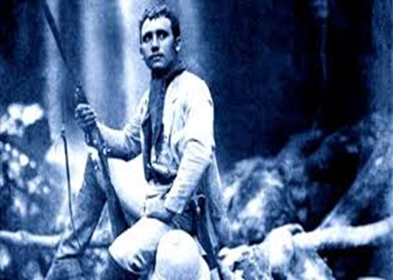

Cândido da Silva Rondon — baixinho, "tarracudo", inteligente e destemido. Cruza de índio com francês. Não dominava o inglês, mas foi guia do presidente Theodore Roosevelt pela Floresta Amazônica.

*Cândido Rondon jovem em expedição pela selva.*

Nascido em Santo Antônio de Leverger, ao costado de Cuiabá, em 1865. Apreciador de peixe com piqui. Foi militar, tendo chegado ao posto de Marechal. Faleceu em 1958. Em sua homenagem, o Território Federal do Guaporé passou a se chamar Território Federal de Rondônia, hoje Estado de Rondônia.

Construiu a linha telegráfica estabelecendo a comunicação entre a capital da República, Rio de Janeiro, e a cidade de Rio Branco, no Acre, com o marcante trecho entre Cuiabá e Porto Velho.

> "Durante o governo do presidente Washington Luís foi criado o Serviço de Inspeção de Fronteiras para vigiar e nacionalizar as fronteiras. Para chefiá-lo foi nomeado o general Cândido Mariano da Silva Rondon. Foram visitadas as fronteiras do Oiapoque, girando para oeste e para o sul através das fronteiras da Guiana Francesa, Guiana, Suriname, Venezuela, Colômbia, Peru, Bolívia, Paraguai, Argentina e Uruguai." ([Fonte: Brasiliana Fotográfica](https://brasilianafotografica.bn.gov.br/?p=17506))

Como dito, Cândido Rondon foi guia de Roosevelt na Expedição de 1913 e 1914, quando seguiram o curso do Rio da Dúvida, antes denominado Rio da Confusão, hoje Rio Roosevelt. Na verdade, é um rio cheio de curvas que nasce em Rondônia, passa por Mato Grosso e termina no Amazonas. Foi denominado Rio Roosevelt em homenagem ao americano Theodore Roosevelt, que se mostrou tão interessado em descobrir sua nascente.

A expedição teve início em Cáceres com 15 pessoas. Certo é que não é um rio navegável a ponto de não ter despertado o interesse da marinha americana. Podemos admitir que Roosevelt era um aventureiro e queria ter uma experiência de selva. Para isso, nada melhor que convidar Cândido Rondon como companheiro de aventura.

Buscaram a nascente na Chapada dos Parecis, atual município de Vilhena. Descobriram que ele é afluente do Rio Aripuanã. Tudo bem. Devem ter matado algumas onças e caçado algumas borboletas para serem colocadas em algum museu de Nova York. O curioso é que, anos antes, Rondon ao construir a Linha Telegráfica, fez um ângulo de 70 graus seguindo rumo ao Rio da Confusão, para depois retomar seu trajeto rumo a Porto Velho. Diga-se, no entanto, que Rondon era "macaco velho" e conhecia cada pau daquele caminho. Não teria ele cometido um engano. Foi uma confusão, ou uma fusão de coisas. Para justificar denominou o córrego de Rio da Dúvida. Os trabalhos de Rondon já corriam o mundo, foi então que recebeu o convite de Roosevelt para juntos solucionarem o problema hidrogeográfico.

É aqui que a porca torce o rabo. Rondon, quando da construção da linha telegráfica, alardeou, para não dizer que relatou, espalhou uma "FAKE NEWS" sobre a existência de uma tribo de índios com flechas com ponta de ouro e enfeitadas com pedras de diamantes. Afinal de contas, ele também tinha direito de contar bravatas ou lendas.

Fawcett, explorador e aventureiro inglês, já tinha enfiado seu nariz pela Bolívia à procura de uma cidade perdida. Depois se enfiou pelo Brasil e acabou se perdendo na Serra do Roncador, MT. Sumiu e nunca mais se teve notícia. Verdade é que estava bem longe do Rio da Dúvida. A confusão deve ter sido outra.

Verdade é que não longe das nascentes do Rio da Dúvida existe uma das maiores minas de diamantes do mundo, justamente na reserva Roosevelt. A pergunta que não quer calar: não seria isso que Roosevelt estava procurando? Talvez Rondon não quisesse ensinar o caminho das pedras.

Não podemos falar de Rondon sem dizer do seu bom relacionamento com os povos nativos. Com certeza houve alguns atritos, porém ele era descendente dos nativos mato-grossenses e bem sabia como tratá-los. Defendeu o direito ou o princípio de que os povos indígenas têm o direito de se integrar aos costumes da nossa civilização e foi o propositor da criação de áreas indígenas onde fossem assegurados os seus direitos e as suas culturas.

Além de militar, foi um humanista. Teve indicação para o Prêmio Nobel da Paz. A indicação foi feita simplesmente por Albert Einstein.

> "...uma carta do físico Albert Einstein, escrita em 1925, recomendando ao comitê do prêmio o nome do marechal brasileiro Cândido Rondon (1865-1958). Einstein redigiu a carta ao comitê do Nobel, sediado em Oslo (Noruega), a bordo do navio Capitão Polônio, depois de uma viagem de 51 dias pelo Brasil, Argentina e Uruguai, a maior parte dela passada no Rio de Janeiro." ([Fonte: Folha de S.Paulo](https://www1.folha.uol.com.br/fsp/cotidian/ff0707200236.htm))

Lembremos que em 1925, Einstein estava na flor da idade, e o Rio de Janeiro, com certeza, já oferecia alguns atrativos turísticos. Dizem até que deu pitaco sobre a construção da Estátua do Cristo Redentor.
