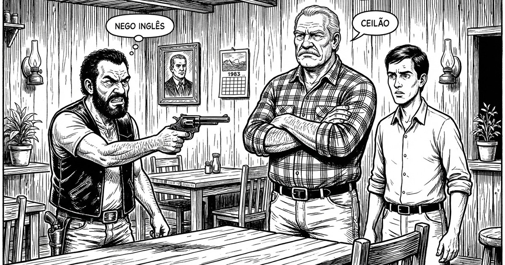

Já estava me acostumando na nova cidade. Conhecendo uma pessoa aqui, um comerciante ali. Muitos vinham ao escritório com pendengas diárias, questão doméstica. Nas ruas muita poeira e ruídos de alto-falantes na ponta dos postes — conhecido como pau do fuxico — ou sobre veículos anunciando produtos e notícias do momento. Lojas e bares de sinuca.

Havia entre outros um restaurante popular chamado **"Roda Viva"**. Ali fazia minhas refeições. O proprietário Genésio não estava muito satisfeito com o negócio. Dizia ele: muito trabalho para pouco resultado.

Um dia chegou na cidade um sujeito tipo "lombrosiano", conhecido por **Nego Inglês**, que não deixava claro qual sua verdadeira ocupação. Um rolista. Correu notícia que era pistoleiro, porém nada havia que pudesse incriminá-lo.

De outra feita apareceu na praça um sujeito forte, loiro, que dizia ter vindo do Sul e não demorou para receber o apelido de **"Polaco"**. Pretendia se estabelecer no ramo de bar e restaurante. Genésio viu a oportunidade e propôs a venda do Roda Viva. Ficou claro que o dinheiro do Polaco não era muito. O negócio se concretizou quando interveio o Nego Inglês, propondo uma sociedade.

Conversas e acordos — a transação aconteceu. Tomaram posse do estabelecimento e tudo bem. Porém nem tanto. Logo no segundo dia percebeu-se que a qualidade do serviço havia caído, muito embora já não fosse grande coisa. Certo é o ditado: nada é tão ruim que não possa piorar.

## O Almoço do Terceiro Dia

No terceiro dia, chegando para o almoço, senti algo estranho no ar, sem saber o que poderia ser. Observei os comensais e ali estava o **Ceilão** — um senhor forte e muito respeitado por suas atitudes firmes. Mais alguém além de Genésio que ainda aguardava pelo pagamento do que fora acordado.

Busquei uma mesa e estava no aguardo, quando adentrou um conhecido. Intuitivamente perguntei-lhe se estava com fome.

— Muita, disse ele.

— Então coma e saia logo.

Quis saber por quê. Nada não, respondi-lhe — até mesmo porque não fazia sentido o meu alerta.

Foi quando escutei o grito:

— **Polaco, não abra a boca porque te entupo de bala!**

Era o Nego Inglês com arma em punho, apontando pro sócio.

Havia uma porta dos fundos que dava para um brejo tomado pela quiçaça e por ela vi meu amigo se jogando. Coisa de cinema.

Fiquei como se estivesse vagando no espaço. Naquele sufoco vi o Ceilão tentando amenizar a situação. O Polaco estava mais amarelo que ipê na florada. Indeciso, cheguei no costado do Ceilão e balbuciei:

— Nego Inglês... se você fizer alguma coisa, não vai ficar bom pra você. A polícia está aí pertinho e vai lhe prender.

Para aumentar meu espanto, o Nego Inglês baixou a arma e disse:

— Tá certo, **seu dotô**.

E jogando na minha mão a chave do Jeep velho sem capota, intimou-me a levá-lo pra fora da cidade. Não tive como recusar tão importante convite. Era meio-dia e meio, mais ou menos. O sol de torrar castanha. Acelerei na rua empoeirada. Já fora da cidade, Nego Inglês mui cordialmente falou:

— Aqui tá bom, **seu dotô**. Muito agradecido.

Assumiu a direção e sumiu na vicinal. Sobraram-me dois quilômetros no sol escaldante, sapecando a cabeça já com pouca cobertura.

## O Que Ficou

Após meia hora de exaustante caminhada, cheguei no restaurante ainda pensando encontrar um prato de comida. Ali estava Genésio. Percebendo a minha presença perguntou:

— Cadê o Nego Inglês?

— Deve ter ido pros quintos dos infernos, resmunguei.

Genésio estava inconformado por ter que reassumir o negócio, visto que ninguém lhe dera um tostão.

— E o Polaco?, perguntei.

— O Polaco?... Acabou de subir no ônibus dizendo que estava retornando para Santa Catarina para nunca mais pôr os pés neste inferno.

Nunca mais vi o Nego Inglês. Muito menos o Polaco. Não demorou e o Roda Viva fechou as portas. Ceilão, tempos depois, sofreu um infarto — que Deus o tenha em sua infinita bondade. Genésio ainda permaneceu por lá um bom bocado. De um tempo não mais o avistei; afinal das contas é assim mesmo — as pessoas vão andando por esse brasilzão e somem como as notícias. Tudo fica no "ouvi dizer que...".

Quanto ao amigo que chegara para almoçar naquela hora tão imprópria, por vezes o vejo. Continua firme e forte, mas não comenta sobre o fato.

De resto, conforme dizia uma certa pessoa cuja identidade desconheço:

— Não é da sua conta. Porém, em sendo relevante, posso até prestar esclarecimentos — todavia, por se tratar de fato público e notório, ficam dispensadas as provas.
