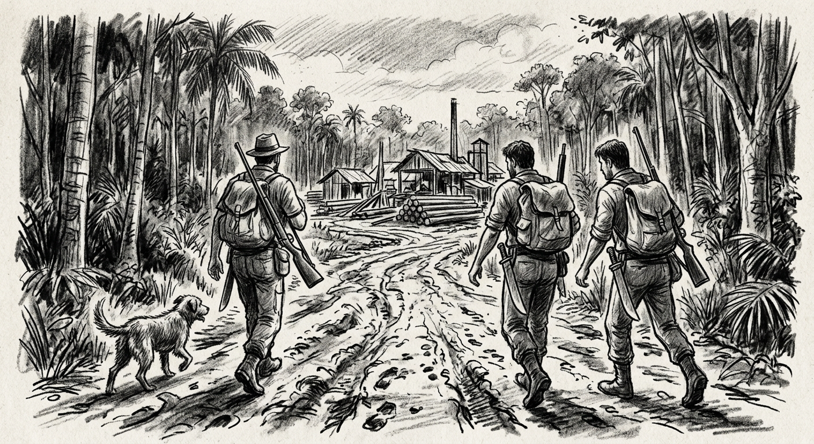
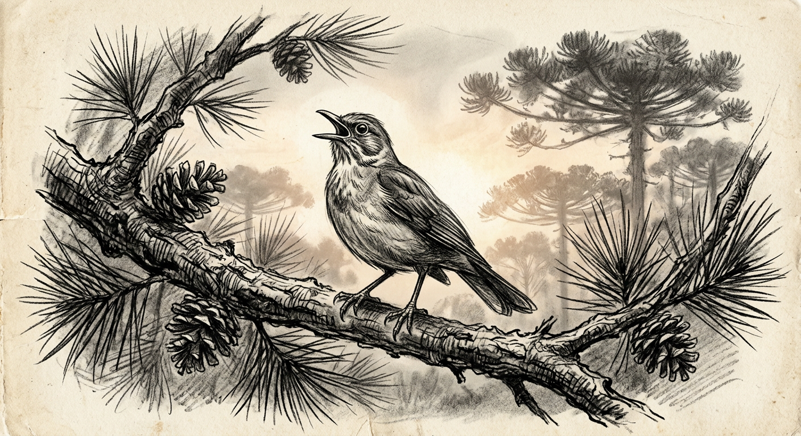

Minhas recordações levam-me ao tempo de infância. Dos então sete, eu era o quarto. Brincávamos entre arvoredos e pedregulhos. De pega-pega e esconde-esconde: *"Guiri, guiri gaio... escampa sotto il gaio."* Há capito? — *"Alora fatte furbo."* — *"Sete tu in cielo, ora piu belo, secondo marino, para andare in pescaria, tre narance e tre limone, pinfete, pinfete, mandolo via."*

Não sabíamos o significado, mas brincávamos de esconde. *(Você no céu será o mais bonito. Segundo o marinheiro para ir na pescaria, três laranjas e três limões, pimfe, pafe te mando embora.)*

Do topo da campina, via-se ao longe, além do vale, uma vila. Imaginávamos como seria. Uma igreja grande, muitas carroças, uma bodega com caramelos e brinquedos. O sonho era atravessar o vale e com alguns passos chegar lá. De uma feita, calçamos as botas de papai, imaginando que com elas nossos passos seriam longos e lá chegaríamos num instante. Sequer conhecíamos a história do Pequeno Polegar e do Gigante com botas de sete-léguas. Quem nos poderia contar? Tudo o que ouvíamos era a história do Negrinho do Pastoreio. Pobre Negrinho do Pastoreio. Nossa sina era melhor que a dele. Não tínhamos que procurar cavalos na escuridão. Porém, tínhamos o desejo de transpor o vale num passo de mágica.

Um dia, no começo do inverno, papai nos disse: — vamos mudar, vamos embora. — O que seria isso? Ir embora, mudar?... Lembro apenas que certa manhã apareceu um caminhão e tudo foi carregado. Camas, panelas, galinhas, porcos, uma vaca, o burro e até os dois cachorros. Ficou o gato, que foi pro mato, que o fogo queimou, que a água apagou, que o boi bebeu, que foi puxar milho, que o padre levou e foi por ali foi e por ali sumiu.

Partimos por volta do meio dia. Todos os seis, mais papai e tio Ângelo acomodados sobre a carga. Na cabine, além do chofer, foi mamãe com o maninho menor de apenas dois anos e mais um na barriga. Logo chegamos na sonhada vila. Tudo que lembro: uma bodega, algumas pessoas, abraços de despedida e de alguém que nos deu um punhado de caramelos.

Seguimos viagem. Logo mais transpomos o rio Uruguai. Subimos a encosta e já noitinha chegamos em uma cidade. Um assombro. Casas com luzes que não se pareciam com velas ou lamparinas. Papai nos disse ser luz elétrica. Pousamos em um hotel. No quarto, além de camas, uma bacia, um jarro com água e ao pé da cama o conhecido pinico.

A viagem seguiu logo no clarear do dia. Passamos por descampados cobertos de geada. O frio era cortante, todavia, estávamos bem agasalhados, enrolados nos acolchoados de penas de galinha. Tão curiosos quanto nós, estavam os dois cachorros encoleirados, o burro e a vaca confinados na traseira do caminhão. Já não lembro do quanto mais vimos, além de o vento ter arrancado o chapéu da cabeça do tio Ângelo que nos acompanhava. Jamais imaginara ir além do vale, além da vila.

De repente, outra cidade, maior ainda, muita gente, filas de caminhões e automóveis. Fogos de artifício e nós no caminhãozinho em meio a tudo aquilo. Senti o coração bater forte. Vi os cachorros ganindo aturdidos pelos fogos. O burro agitado, de orelhas erriçadas, e, apertados no mesmo cercadinho, a vaca e o bezerro. Alguém disse que a cidade se chamava Pato Branco. Era dia de São Pedro, o padroeiro da cidade e aquele era o momento da procissão. Precisamente dia 29 de junho e o ano era 1957. Eu tinha sete anos.

Não demorou e tudo ficou para trás. O caminhão embrenhou-se por uma estrada estreita sombreada pela mata coberta por pinheiros. Um cenário nunca visto. Por volta da meia tarde chegamos ao destino. Em meio ao quase nada, um rancho de tábua lascada, que sequer coube a pouca mobília.

Um longo passo dado por papai e nós ali agarrados em suas botas. Papai era um gigante.

## O rancho do tio Eurico

O rancho que morávamos era do tio Eurico. Mal coube a pouca mobília que tínhamos. O fogão a lenha ficou do lado de fora. Também emprestou um pedaço de terra para plantar. Havia uma capoeira. Fizeram um mutirão. Pela manhã compareceram mais de vinte peões com foices e facões. Foi lindo ouvir o *"vapete-vapete"* das foices, o mato caído e os peões gritando, *capoeira!... auia!...*

Ao meio dia, almoço para a peonada. O pagamento era o fandango. Na outra semana, à noitinha, apareceram os violeiros, uma gaita e um pandeiro. Peões alinhados, botas lustradas, cabelos na brilhantina, moças e mulheres de lábios pintados, ruge nas bochechas, perfumadas e sandálias moreninha. Só lembro do começo da cantoria. As crianças tinham que dormir enquanto o fandango corria pela madrugada.

Chegou a primavera e com ela mais um guri, agora éramos nove. Chegou a colheita do trigo. A aparelha de burros se assustou e disparou com a carroça. Foi caco pra todo o lado. Papai saltou e não se machucou.

Preparamos os chapéus com capim para o burrinho do Papai Noel. No amanhecer o capim havia sumido e nos chapéus alguns caramelos e não mais que três bolachas maria.

Mais alguns dias mudamos mais acolá, e de repente estávamos dentro de uma bodega. Não aquela da vila, mas uma instalada dentro da nossa casa. Papai agora era bodegueiro. Havia de tudo um pouco. Cachaça, fumo em corda, rapadura, chumbo, pólvora, ferramentas, tecidos e armarinhos, caramelos e bolacha maria. Tudo fluía na base de troca. Cereais, galinhas e até serviços. Era uma freguesia bem eclética. Os caboclos, a italianada, e alguns polacos. De quando em vez uma confusão, sempre apartada por papai que era o conciliador. Não podia espantar a freguesia.

Eu, guri, observava tipos como o **Theodoro**, viciado no baralho, e o **Pedrinho Facão**, sempre alegre contando lorotas. Mas ninguém causou tanto bafafá quanto o **João Madalena**.

Ninguém sabia de sua origem. Por ali chegara, montado em um cavalo bem encilhado, com uma mulher e dois filhos, e se acomodou num rancho já abandonado. Seguidamente comparecia na bodega mais para tomar um trago do que para fazer alguma compra. Uma feita, já noitezinha, solicitou ao papai que lhe entregasse um punhal que havia depositado na chegada. Papai, sabendo que ele não havia depositado faca alguma, mesmo assim esforçou-se e procurou. Entreguei, não entregou — e a prosa azedou. João Madalena foi enrolando a açoiteira no cabo, em claro sinal de ataque. Papai arremessou o peso de balança que pegou de raspão na testa do sujeito.

Foi aquele ba-fa-fá. As portas foram fechadas e nós corremos para o sótão, tremendo de medo. O homem estava vivo — apenas com um pouco de sangue. Montaram nos cavalos e sumiram na escuridão.

Não demorou e ouviu-se o tropel parando em frente à bodega. Alguém gritou: — Abre a porta senão vamos arrombar na bala! Mamãe viu quando papai empunhou o revólver. Num golpe de coragem, tomou a arma da mão dele e abriu a porta dizendo:

— **Atirem, seus covardes!**

Houve entre eles alguém de bom senso: — É uma mulher! Mesmo assim fizeram papai prisioneiro. Mamãe montou num burro manso e partiu noite adentro rumo à autoridade. Era meia-noite quando acordaram o delegado. Na madrugada cercaram o rancho. Todos se entregaram sem resistência.

O delegado declarou solenemente: — Todos estão liberados, mas proibidos de frequentar bodega por 30 dias. Mais: voltem agora para suas casas, a pé e no sol quente.

### O Velório da Velha Sebastiana

As histórias não se davam só no balcão — seguiam pelos velórios até a beira da cova. No velório da **velha Sebastiana**, a paz durou pouco. Seus filhos, **Manezinho** e **Emiliano**, já não se bicavam. Emiliano, embriagado, provocou tanto que Manezinho puxou do facão em pleno velório. Para não ser retalhado, o Emiliano arrancou a cruz que guarnecia o caixão da própria mãe e usou-a como escudo, protegendo-se do facão que reluzia naquele lusco-fusco. O velório prosseguiu pela madrugada, sob o olhar atravessado dos irmãos por cima do corpo da falecida.

### O Rabo-de-Tatu

De outra feita, Emiliano provocou um cunhado chamando-o de ladrão de cano de fogão. O cunhado, munido do **rabo-de-tatu**, desceu o mango que fez um estrago na paleta. Emiliano com o lombo ardido continuou: — Ladrão, sem vergonha! E lá se foi mais um laçaço, retrucando: — Podem me chamar de ladrão, mas não de sem vergonha! Mas logo tudo se acalmou — exceto Emiliano, que pediu que lhe massageassem com cachaça. Fizeram. Mas aí o berro foi maior.

## A escola e o mundo lá fora

A menos de dois quilômetros, uma escola que também servia de capela. Lá íamos para a reza aos domingos e durante a semana para prender o ABC. Sol, chuva, barro, geada e apenas chinelinhos nos pés e *"guarda-passo"* à tiracolo — e dentro um lápis, uma borracha, um caderno, a cartilha e uma batata cozida para o lanche. Era assim. Aprender a ler, escrever, fazer continhas, as cores da bandeira e catecismo. Pedro Álvares Cabral descobriu o Brasil e Jesus nasceu em Belém numa manjedoura. O que seria uma manjedoura? Uma palavra esquisita. Tão esquisita quanto os reis magos e Herodes. José e Maria, tudo bem — mas Herodes?... Não dava nem pra imaginar alguém com esse nome.

Corria notícias de jagunços e de revolta. Gente que ia e que vinha a cavalo, com revólver na cinta. Falavam de um levante dos colonos e que gente havia morrido. Depois, que veio o exército e tudo voltou à normalidade. Depois um Movimento pela Legalidade e de um plebiscito onde o povo tinha que votar Sim ou Não — e ninguém sabia o que era. A maioria seguiu o conselho do padre. Venceu o Não.

Passaram-se alguns anos e o tempo de criança. Papai preocupado. Vejo agora como ele era um gigante. Transpôs o vale, as campinas, enfrentou os sertões e correu riscos. Os filhos, onde fazê-los estudar? Colégio de padres seria um caminho seguro. Aos doze anos, reiniciado o primário, porque a cartilha era diferente — aliás, tudo. Chorei, sem saber porque. Foi quando alguém me disse que era por causa da saudade.

De vez em quando ouvia as pessoas falarem da nova capital. Quando já dava para entender alguma coisa do Brasil e do mundo, lembro que os padres diziam que a Rússia era comunista. Os nomes mais falados eram Jango, Brizola e revolução. Finalmente a notícia de que o exército havia tomado o poder. O nome agora era Castelo Branco.

Aos dezesseis anos, um ano de admissão para iniciar o ginasial. Aos dezoito, alistamento e inspeção militar. Fui dispensado.

Como se estivesse na sobrecarga do caminhãozinho de mudança, ousei calçar as botas de sete léguas. Aos trancos e barrancos fiz o científico e ingressei na faculdade, entremeio aos alardeados anos de chumbo e o Milagre Brasileiro.

## O novo eldorado

O Brasil se estendeu pelas trilhas rasgadas pelos bandeirantes, tropeiros, garimpeiros, seringueiros, aventureiros. Metas ambiciosas traçadas pelo governo para a integração da Amazônia.

No início dos anos oitenta, como tantos outros, fui em busca do alardeado novo eldorado. Rondônia. Por entre as nuvens contemplei a mata quase infinita. Em terra: rios, brejos, atoleiros, picadas. Antas, onças, tatetos, pico-de-jaca e pernilongos. Peixes, ariranhas e jacarés. Papagaios, arraras, garças e o irritante biscateiro. *(Passarinho quase invisível e de forte assobio.)* Malária, leishmaniose e verminoses. Cidades surgindo do nada. Serrarias, barracos, bolichos e peões. Acidentes, assassinatos e tragédias. Gente com mochila nas costas — *"cacaio"* — levando apenas sal, farinha, pólvora e chumbo. Carabina à tiracolo, terçado na cinta e foice na mão. *Auia!... lá vem madeira!*

Migrantes do sul, nordeste e sudeste em busca da terra prometida, da sobrevivência e da riqueza. Exploração e madeira. Ganância, bravuras, aventureiros e gente humilde. Todos juntos e misturados. Agricultores, comerciantes, profissionais liberais, médicos, engenheiros. Coragem, suor e resiliência. Nada muito diferente da canção que veio do tempo de antanho — e no caminhão de mudança, reescrita por Vinícius de Moraes:

> *Tem certos dias em que eu penso em minha gente e sinto assim todo o meu peito se apertar.*\
> *Porque parece que acontece de repente, feito um desejo de eu viver sem me notar.*\
> *Igual a como quando eu passo no subúrbio, eu muito bem vindo de trem de algum lugar.*\
> *E aí me dá como uma inveja dessa gente que vai em frente sem nem ter com quem contar.*\
> *São casas simples com cadeiras na calçada e na fachada escrito em cima que é um lar.*\
> *Pela varanda flores tristes e baldias como a alegria que não tem onde encostar.*\
> *E eu que não creio peço a Deus por minha gente. É gente humilde que vontade de chorar.*

*Vida de gado, povo marcado, povo feliz.* — Zé Ramalho

Parece que aconteceu tudo de repente. Lá estava eu no meio dessa gente, com meu sal e a esperança de poder ir além do vale. Mais de três décadas vivenciando a transformação da paisagem, participando do florescer de cidades e vendo crianças se fazendo adultos e dando continuidade àquele sonho.

## O coração engolindo caroço

Um dia, já na bela idade, próximo ao dia da procissão de São Pedro, subindo o barranco do igarapé, senti o fraquejo. Bastou o encosto do estetoscópio para saber que o coração estava *"engolindo caroço."* Lá *"vai nóis."* Madeira...; corre *"que o bicho pega."*

Botas de sete léguas e subir no caminhãozinho de mudança. Agora não mais pela viação Taba, mas por um moderno. Voando por cima da quase extinta floresta, retornei para a terra das araucárias. Curitiba e ao seu costado uma campina. Campina Grande do Sul.

Naquela campina vi muita gente em busca de um novo eldorado. No corredor, parecendo uma procissão do padroeiro, uma fila de macas. Cada qual em busca de seu sonho e milagres. Eu ali em meio a tudo aquilo, com o *"cacaio"* jogado de banda. Foi um instante em que pensar na vida não fazia o menor sentido.

Foi só uma agulhada e, como se fosse um esturro na floresta, tudo silenciou. Acordei no clarear do outro dia. Pela janela do hospital vi a copada de um pinheiro e ouvi o cantar de um pássaro. Não era o pio do biscateiro. Reconheci o harmonioso canto do sabiá.

Ainda sob os efeitos da anestesia, entendi que meu coração pulsava. Depois, mirando o teto, senti o frio. O frio do mês de agosto. Tive a sensação de estar no topo do caminhãozinho, vendo os campos cobertos de geada. A geada fria que queima o assa-peixe, que rebrota na primavera, para florir e produzir o melhor dos pólens e o mais gostoso mel.

## Continuidade

No caminho natural das pedras, dei entrada no INSS e logo veio a aposentadoria. Natal. Oh, oh, oh. Coração batendo e a vida continuou. Não é um começo, nem recomeço, simplesmente continuidade.

Ver os filhos transpondo os vales e netos brincando de *"Sonic"* dá uma alegria esquisita. Alegria por saber que além do vale existem campinas e outras coisas que a vida ensina. Alegria esquisita de saber que o que se começa, de alguma forma termina.

Por vezes, vem a saudade. Saudade do caminhãozinho de mudança e até daquilo que gostaríamos ter vivido. Sentir saudade é a certeza de estar vivo. É o prêmio da vida.

> *"Vós me chamaríeis e eu responderei, teríeis saudade da obra de vossas mãos."*\
> (João 14,15)
