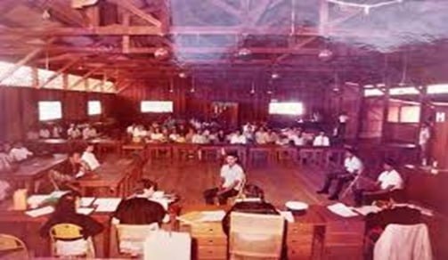
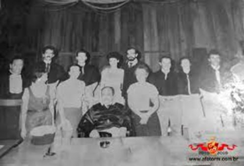

Município criado, instalado, prefeito eleito e empossado. Por decisão do Tribunal foi criada a Comarca. Fez-se a instalação por um ilustre e desconhecido desembargador, porém não foi designado juiz. Dada a competência territorial, centenas de processos vieram para a nova comarca. Por certo, houve um desafogo no escaninho do escrivão da comarca de origem.

Não há mal que sempre dure nem bem que sempre ature. Depois de meses de expectativa chegou o juiz. Juntamente com ele o Promotor de Justiça e auxiliares. Os poucos causídicos logo abarrotaram os escaninhos com novas demandas, ao tempo em que o Delegado de Polícia diariamente encaminhava novos inquéritos por fatos e ocorrências policialescas. Não demorou e o Juiz emitiu sentença de pronúncia. Sorteou o corpo de jurados e designou data para o julgamento.

Foi o primeiro júri da comarca. Também o primeiro do Juiz, do promotor, dos auxiliares e do advogado de defesa. Todos primários, inclusive o Réu.

*O salão do Tribunal do Júri — um barracão pau-a-pique onde antes havia bailes e arrasta-pés.*

O salão do júri: um barracão pau-a-pique onde rotineiramente a sociedade se reunia ao som de uma sanfona, um pandeiro e um violão para bailes e arrasta-pés. Quem diria que aquele salão serviria de palco para ato tão solene.

Debates acalorados entre a acusação e defesa. Ao final, o veredito. O corpo de jurados acatou a tese de legítima defesa com excesso culposo. O réu saiu em liberdade. Primário, de bons antecedentes. Um alívio geral. Não havia presídio para segregar o réu, caso a pena fosse privativa de liberdade.

**O fato:** a vítima foi atingida por um tiro de espingarda de caça, após supostamente ter ameaçado o réu com uma faca. A vítima tinha fama de matador, embora dos autos apenas constasse fotocópia de sua cédula de identidade, sabendo-se por ouvir dizer que era procedente do Mato Grosso. O réu, temendo pela sua própria vida e utilizando-se do único instrumento que possuía, puxou o gatilho e, sem a intenção de matar, atingiu a vítima pelas costas — momento em que esta tropeçou em um cipó e caiu em decúbito ventral. Tudo conforme laudo circunstanciado lavrado pelo policial que resgatou o corpo à beira de um rio em mata fechada — diga-se de passagem, floresta amazônica. O réu andou vários quilômetros por trilhas sinuosas a fim de comunicar o fato à autoridade policial.

**Conclusão:** o corpo de jurados não condenou, nem absolveu.

Primeiro júri da Comarca da cidade de Rolim de Moura.

*Da esquerda para a direita: o Juiz Sérgio Nogueira de Lima, o promotor Jaime Ferreira, o advogado de defesa Adi Baldo e os serventuários da Justiça — Rolim de Moura, 1983.*

---

*"Recém-chegado a Rolim de Moura, a 483 quilômetros de Porto Velho, o juiz de Direito Sérgio Nogueira Lima trouxe o martelo da Lei para uma cidadezinha ainda sem recursos. No entanto, sofrimento maior teve seu antecessor, Aldemir, que permaneceu menos de um ano no cargo. Até para telefonar, ele tinha que ir à Prefeitura, onde estava instalado um dos poucos aparelhos em repartições oficiais; andava de bicicleta."*
— Adi Baldo, advogado, que em 1983 participou do primeiro júri no salão de um clube.
