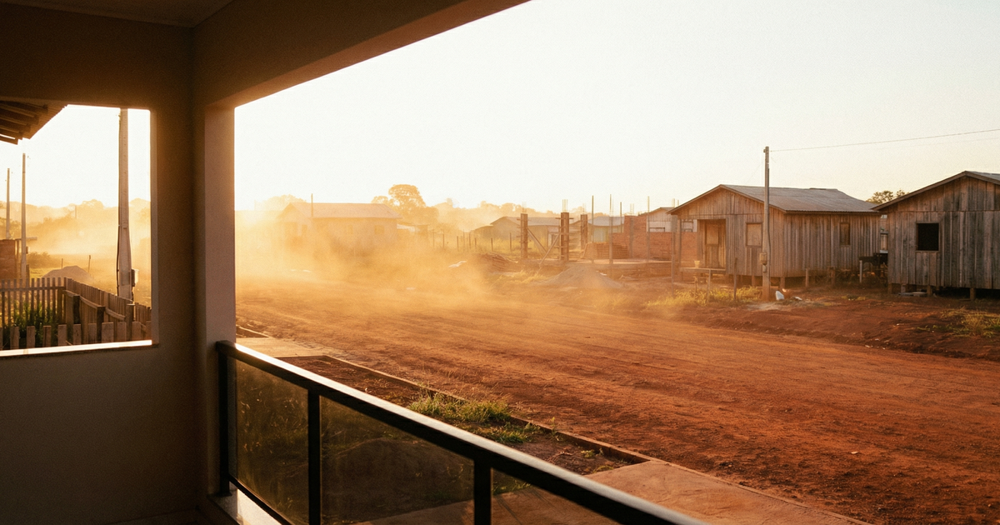

Era o ano de 1982. Concluída a faculdade, era imperioso procurar um lugar para iniciar a vida. O Paraná já se mostrava saturado de bacharéis. Não havia como pensar em concursos. De origem humilde, devia prover o próprio sustento e era quase impossível se preparar para um concurso. No mais, a idade exigia que se buscasse a autonomia. Deveria existir um lugar para exercer a profissão livre de tanta concorrência. 

Um ano de estágio em escritório de advocacia foi o suficiente para entender que a luta seria aguerrida. Com palpites de terceiros, fé e coragem, decidi que fosse conforme os desígnios do Arquiteto do Universo. Rondônia estava no auge da migração de todas as partes do Brasil. Decidi: é pra lá que eu vou! Mas onde? Alguém que nunca havia saído do burburinho da Rua das Flores aconselhou-me: 
— Vá para Cacoal. Não sei onde fica, mas tenho um amigo que foi pra lá. 

Pareceu-me uma boa ideia. Pelo menos tinha uma referência. Fazer a mala e partir. 

### A Grande Travessia

Em março de 1982, parti de [Curitiba](/locais/curitiba/) com uma mala e uns pacotes. De um só lance, a Viação Andorinha, partindo de Maringá, atravessou o cerrado matogrossense. Uma viagem um tanto monótona. Por vezes a paisagem era quebrada pela presença de seriemas, casebres, barracas de lona e tratores que já começavam a rasgar o cerrado. Foram 24 horas de viagem até Cuiabá. 

Descendo do ônibus e procurando me localizar, vislumbrei um anúncio: **PASSAGENS PARA CACOAL**. Que bom! Está fácil. 
— Moço, uma passagem para Cacoal. 
— Terás que aguardar até que o ônibus que vem de lá chegue. 
— E quanto tempo devo aguardar? 
— Bem, faz quinze dias que ele não chega. 
— Então não tem ônibus!? 
— Tem sim, é só não ter pressa. 

Foi uma ducha de água fria despejada em meu corpo suado, cansado e empoeirado. Era uma outra realidade. Tinha ônibus, mas, ao mesmo tempo, não tinha. Alguém aconselhou: “Daqui pra frente só de avião”. Quem está no barro tem que se enlamear. 

Após conhecer algumas particularidades da região, consegui uma vaga no voo semanal da TABA (Transportes Aéreos da Bacia Amazônica). Uma aeronave do tempo da guerra. Talvez tivesse cumprido algumas missões jogando bombas sobre redutos nazistas ou transportando o brigadeiro Eduardo Gomes. Bimotor, dezesseis lugares. Todos os passageiros acomodados em assentos espremidos por malas, caixotes e bugigangas. Até uma gaiola com um filhote de cão de caça e outros bichos. 

O avião partiu às 14:30 horas. O tempo estava bom. Da janelinha dava para contemplar o infinito da floresta e por vezes sumíamos entre as nuvens encasteladas. Por volta das cinco da tarde a nave aterrissou na cidade de Pimenta Bueno. A pista era um lamaçal ladeado pela floresta. Restavam 50 quilômetros para o destino final. 

Ali mesmo na pista apareceram táxis. Lotamos um Fusca e partimos. O taxista alertou que havia atoleiros no Riozinho e teríamos que passar por dentro da aldeia indígena: era necessário pedir autorização do cacique. Já era noite, o motorista desceu e foi um momento de tensão. Retornou com permissão para passar. Parece que naquele dia o cacique estava de bom humor (via de regra, um litro da boa). 

Finalmente, Cacoal. Nem parecia ser uma cidade. Chovia e tudo estava escuro, exceto a varanda de um hotel: “Hotel Decolares”. Janta, pernoite e café da manhã. Dia 22 de março de 1982. O bom da história é que o dinheiro acabou. Não furei o teto orçamentário, contudo, foi necessário cortar algumas despesas. 

### O Início da Lida

Clareou o dia e fui em busca da única referência que tinha daquele lugar. Como se apresentar? Assim: com a cara e a Coragem. O sujeito, dono de serraria, recebeu-me muito bem, conforme os costumes. Forasteiro tem que ser tratado com o pisca de alerta. Em seguida, apresentou-me a um advogado paraibano. Fato foi que, às oito horas da manhã, eu estava acomodado em seu escritório. 

Estava tudo certo. Ali era o fim da picada. Só faltava dinheiro para comer e lugar para dormir. Postado na porta do escritório, veio-me na lembrança a história de “Cabeça de Vaca”. Ele sentado na pedra bruta, atordoado com o barulho das águas do Rio Iguaçu, ouviu o conselho do cacique carijó: *Tererê. Fica frio.* 

A questão agora era não querer ser chefe da corrutela. Teria que conviver com os aventureiros que permeavam o ambiente. Ali a regra era cada qual por si e Deus por todos. Com efeito, tudo era começo e nada melhor que seguir o protocolo. União para abrir uma picada, derrubar a mata, construir barracos e pinguelas e velar os mortos. Tudo era compartilhado. 

Capixabas, paranaenses, nordestinos e gaúchos, todos plantando o que conheciam. Carne de paca, de mateiro e tatu. Peixe frito ou ensopado com macaxeira. Malária e Leishmaniose. Escolas pau-a-pique, transportes pau-de-arara. Enfim, foi um ano de conhecimento e resiliência. Era necessário acreditar. 

### Integrar para não Entregar: E Assim Fizemos

Rondônia é o resultado da luta de um povo, chamado que foi pelo Brasil para ocupar e transformar a selva em ambiente de produção e cultura. Sua história é vasta: vai do Forte Príncipe da Beira (1770), passa pela Ferrovia Madeira-Mamoré (1900), pela Linha Telegráfica do [Marechal Rondon](/blog/marechal-rondon/) (1910) e pelos Soldados da Borracha. Getúlio Vargas criou o Território Federal do Guaporé em 1943, e Juscelino abriu a estrada Cuiabá-Porto Velho em 1959. 

Tudo foi feito com suor e lágrimas. De mata inóspita, transformou-se em terra produtiva. O migrante não foi chamado para fazer agricultura sintrópica; foi necessário o uso do fogo para a retirada da mata. Entre erros e acertos, foi construído um ambiente de paz e prosperidade. Um esforço hercúleo, por vezes minimizado por visões externas, mas que resultou na conquista de um espaço para plantar, colher e bem viver.

Em trinta anos, uma população de cerca de trezentos mil subiu para mais de dois milhões. Aqui o Brasil se alargou e se irmanou. Floresceu um Estado com a segunda melhor distribuição de renda e o melhor índice de transparência do Brasil. Destaca-se a pecuária, a piscicultura com espécies nativas e a cafeicultura orgânica premiada. 

Como diz o nosso hino: *“Nós, os bandeirantes de Rondônia, nos orgulhamos de tanta beleza. Somos brasileiros desta fronteira de nossa Pátria. Rondônia trabalha febrilmente... A orquestração empolga toda gente”*. 

E assim fizemos.

---

### Ecos da Fronteira (Comentários de Amigos e Pioneiros)

> **Jose Lopes de Oliveira:** "Parabéns, meu querido colega destemido pioneiro, pela lucidez e reconhecimento da importância do suor e também lágrimas derramadas por todos que regaram e fertilizaram essa abençoada porção do território nacional."
>
> **Silvana Gomes de Andrade:** "E assim fizemos. Muito bem lembrada a história desse povo, Dr. ADI."
>
> **Francisco Pinto Sales:** "O amigo faz uma bela análise de nossa ocupação, desenvolvimento e redenção. Rondônia foi, é e será sempre nossa casa. A custa de muitas saudades, tristezas e sofrimentos conseguimos, nós pioneiros de todas as partes e cantos do Brasil, construir uma Rondônia para todos."
