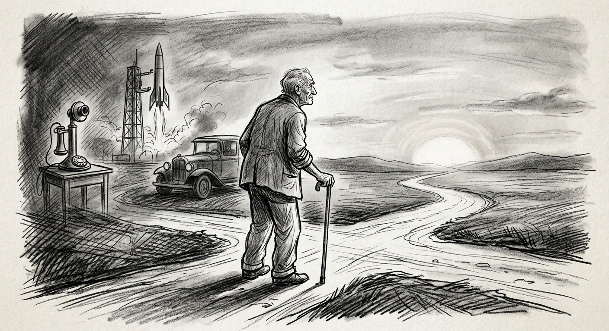

Gosto do meu tempo. Oito de fevereiro de 1950, segundo o calendário gregoriano, apenas um acontecimento de relevância. Nasci. De resto a Wikipédia registra para esta data magistral, o mesmo dia e mês, em 1828 o nascimento Júlio Verne e em 1931 nascimento ator de cinema James Dean. "O ator se imortalizou como um ícone cultural, representando o ceticismo e desilusão dos jovens do pós-guerra", ao passo que Julio Verne escreveu A Volta ao Mundo em 80 Dias. E assim criou o gênero literário Ficção Científica.

Gostaria de comemorar um aniversário na companhia desses dois ícones vez que de alguma forma instigaram-me na juventude com Volta ao Mundo em 80 Dias e o filme Juventude Transviada.

Com o passar dos dias, os romances deram lugar à realidade da vida. Buscando respostas em meio às turbulências. Andei e perambulei. Repito. Gosto do meu tempo. Saímos da pedra lascada para a era digital. A mais curta das eras, a mais pacífica e mais transformadora. Ter vivido neste tempo é ter participado de um momento ímpar da história da humanidade. — Talvez isto não seja importante. — *"O importante é viver, e viver bem."* (Sêneca)

Vale salientar que de 1950 até hoje, muitas pontes foram construídas, podemos citar a Rio-Niterói; poucos rios secaram. Não sei de nenhum, mas lá pelo oriente médio com certeza secaram muitos. Com certeza foi o melhor período após as águas do dilúvio terem baixado. As narrativas das eras são de guerras e tragédias.

Nesse curto período da história o homem foi à lua e outros planetas, evoluiu do telefone discado para o celular e a internet. Constatou a grandiosidade do universo e que a terra não passa de um grão de areia; contudo é azul.

Não sabemos a origem do universo, ou a origem do próprio homem. Sabemos de um diferencial entre as criaturas, que é a capacidade de raciocínio e de rir. Acreditamos em um ser superior que tudo criou. Aprendemos a distinguir o bem e o mal, concebemos a ideia de vida eterna e que estamos aqui de passagem, porquanto, devemos respeitar toda a criação. Enfim, vale o tempo de agora.

De antanho havia um mundo que era igual ao de agora. Diferente era o modo de vê-lo. Talvez fosse grande.

Agora é o de agora. Nem grande nem pequeno, o suficiente para viver, sentir as estações e fazer as coisas à duas ou quatro mãos. Conforme a canção, interpretada pelo cantor do século, Frank Sinatra:

---

**MY WAY**

Eu vivi uma vida completa\
Eu viajei por toda e qualquer estrada\
E mais, muito mais que isso\
Eu fiz isso do meu jeito

Arrependimentos, tenho alguns,\
Na verdade, poucos para citar.\
Fiz porque entendi ser bom fazer\
E vivi por completo sem isenção.

Planejei cada curso traçado,\
Cada passo ao longo do atalho.\
E mais, muito mais que isso...\
Vivi e fiz isto do meu jeito.
