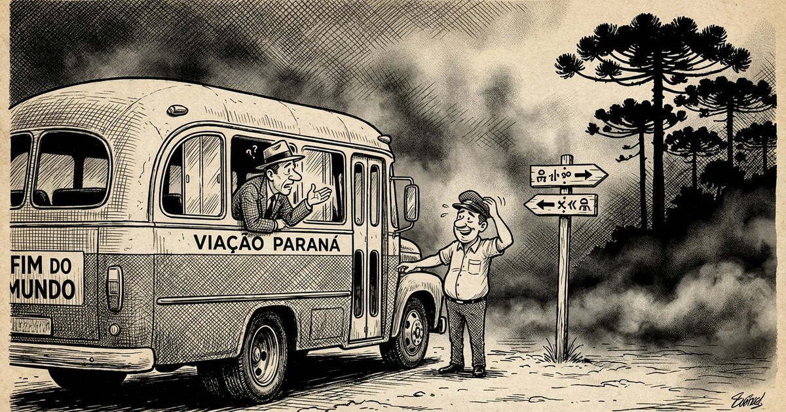

Todo o paranaense sabe onde fica Guarapuava. Uma cidade localizada quase na região central do Estado. Cidade de clima agradável e muita história e tradições. Povo de estilo ímpar. Paranaenses com estilo gaúcho, mas de sotaque caipira por conta dos tropeiros que iam de São Paulo ao Rio Grande, passando pelos campos de Guarapuava.

Antigamente, quando a enxó usava bainha, um paraguaio querendo ir para Curitiba tomou um ônibus e, desconhecendo completamente o trajeto, ainda na rodoviária abordou um cidadão e perguntou:

— Esse vai para Curitiba?

— Vai sim, passa por Guarapuava e outras cidades e chega lá.

— *Muchas gracias*, senhor.

Um pouco confuso com as informações, embarcou — mas lembrou que o sujeito disse que passava por Guarapuava.

## A Dúvida que não Passa

O ônibus partiu e logo chegou em Laranjeiras. O paraguaio, para ter certeza, perguntou ao motorista:

— Esse ônibus vai para Curitiba?

— Sim — respondeu gentilmente o motorista.

— E passa por Guarapuava?

— Sim, passa por Guarapuava.

O paraguaio sentou e ficou atento.

Logo mais o ônibus parou no entroncamento de Cantagalo. O paraguaio se levantou:

— Esse ônibus vai para Curitiba?

— Vai. Vai para Curitiba.

— E passa por Guarapuava?

— Sim, passa por Guarapuava.

O paraguaio sentou e ficou atento.

Cansado, o paraguaio dormiu — enquanto o ônibus passava por Guarapuava.

## O Inferno Fica em Curitiba

Logo mais o ônibus parou em uma vila e o paraguaio perguntou novamente:

— Esse ônibus vai para Curitiba?

— Vai pra Curitiba — disse o motorista.

— E não passa por Guarapuava?

O motorista, já de saco cheio, respondeu:

— Esse ônibus vai pra Curitiba, passa por Guarapuava **e pro inferno!**

O paraguaio, que não entendia bem o português, sentou na poltrona, tentando ficar atento.

Clareava o dia e o ônibus encostou na rodoviária de Curitiba. Um frio de lascar. O motorista, que não havia vestido sua japona, exclamou:

— **Curitiba dos infernos!**

Ao que o paraguaio respondeu:

— *Bueno...* ¡mas no passa por Guarapuava!

— *Buenos días*, señor.
